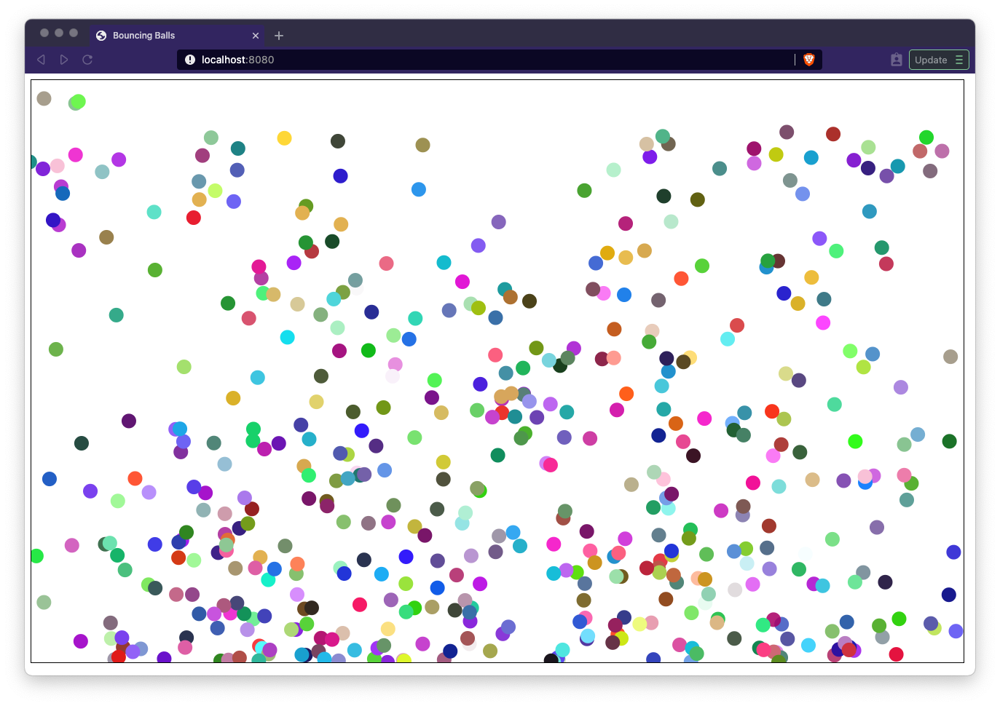
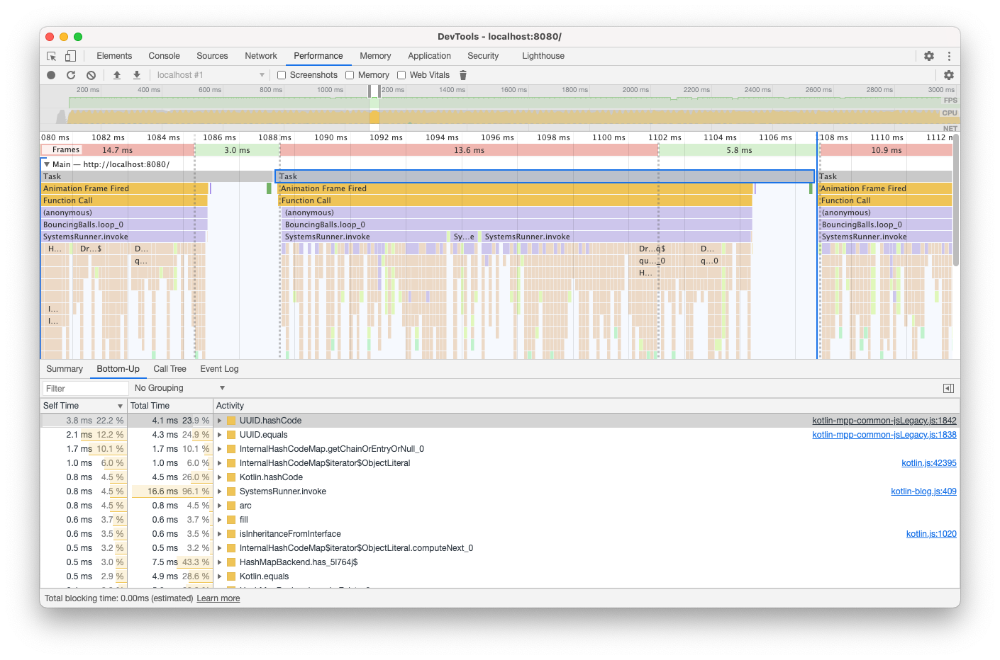
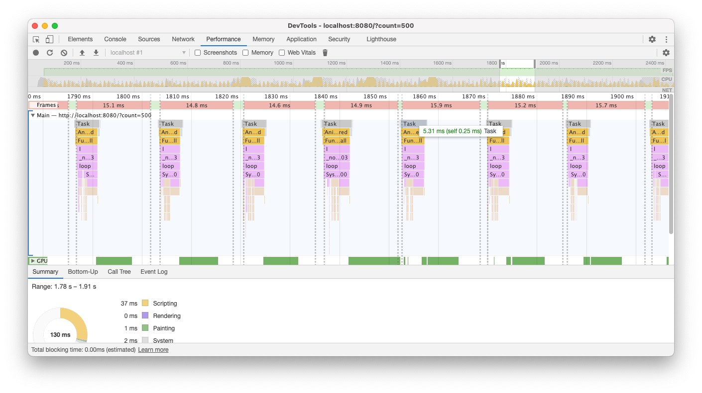

In this post we are going to build an Entity-Component-System architecture from scratch using Kotlin Multiplatform Programming and create a simpel Kotlin/JS simulation with it. Entity-Component-System (ECS) is an architectural pattern that is mostly used in game development and is a compositional design pattern, similar to the ones I describe in my [previous](/compositional-patterns-in-kotlin-part-1-delegation) [posts](/compositional-patterns-in-kotlin-part-2-component-model). 

An ECS-architecture consists of 3 distinct elements: Entities, Components and Systems.

Hence the name, Entity-Component-System. This also shows that Systems are a part of the architecture and ECS does not mean an Entity-Component _System_ (it being a system of entities and components), but Entity-Component-System _architecture_.

The 3 elements of ECS are shortly described as follows:
- Entities: Unique identifiers of _some_ identifiable elements in your program
- Components: Data objects that describe certain traits and are assignable to an entity
- Systems: Routines that iterate over a subset of all entities which have some combination of components and perform some operation over them.

Well, this is still a bit vague of course. But when we refer to my previous post about the [component model](/compositional-patterns-in-kotlin-part-2-component-model) we already had something that resembled ECS. We have Entities that can have behavior dynamically assigned to them. The big difference now is that we move the logic our of the components into systems and we move the storage of components out of the entity. This results in an entity being very very simple. Actually, it is typically just an identifier. An your architecture is actually the method you'll be using for managing the entities, assigning and retrieving the components to them and running the systems. 

As an example, you can imagine that you have some monsters, that are just entities, that contain `Position` and `Sprite` components. A `DrawingSystem` might iterate over all entities that have this combination and draw them on screen, every frame. Do you want some other entities, that are not monsters, to be drawn? Just give them `Position` and `Sprite` components and they should automatically be drawn. The system doesn't care. Then we also have a `GravitySystem` that iterates on all entities that have `Position` and `Mass` components and updates their position based on the gravity. Or, you have an auxiliary system, called `LookupSystem`, which iterates over all `Position` components and puts them in a `QuadTree` for efficient collision detection in other systems.

So what is the benefit of this?

Well, there are a few:
- Highly dynamic composition behavior possible
- Components are very simple data objects, without any logic, making them dead-easy to understand
- All logic is moved to the systems resulting in a very clear responsibility and makes it easier to reason about
- New behavior is just a new system
- Architecture can be optimized for very fast lookup of certain combinations of components

## Defining the architecture

We first start by defining our interface for the ECS architecture. We will keep it as generic as possible, since we don't yet know of want to decide about how we uniquely identify an entity and which components we are going to use. We do, however, want to describe some methods on how we interact with the architecture. This result in the following interface definitions:

```kotlin
interface ComponentKey<C>

interface Component<C> {
    val key: ComponentKey<C>
}

interface Backend<Id> {
    fun create(id: Id? = null): Id
    fun exists(id: Id): Boolean
    fun destroy(id: Id): Id
    fun entities(): Sequence<Id>

    fun <C : Component<C>> set(id: Id, component: C): C?
    fun has(id: Id, key: ComponentKey<*>): Boolean
    fun <C> get(id: Id, key: ComponentKey<C>): C
    fun <C> unset(id: Id, key: ComponentKey<C>): C
}

interface System<Id> {
    val keys : Set<ComponentKey<*>>
    var backend: Backend<Id>

    fun beforeInvoke()
    operator fun invoke(entity: Id)
    fun afterInvoke()
}
```

The `Component` and `ComponentKey<C>` patterns are copied from [my previous](/compositional-patterns-in-kotlin-part-2-component-model) posts, which results in a type-safe storage of components. Furthermore we have a `Backend` which is the main workhorse, that handles the storage and retrieval of components of entities. Lastly we have the `System` interface which we will use to run our systems over the entitites. There are multiple ways to define systems and how to traverse all entities and this is just _a_ method, and not necessarily the best method. However, is pretty general and serves the purpose of this blog post. The `System` interface will be used by a `SystemsRunner` class in order to execute multiple systems:

```kotlin
class SystemsRunner<Id>(val backend: Backend<Id>, vararg val systems: System<Id>) {

    init {
        systems.forEach { system ->
            system.backend = backend
        }
    }

    operator fun invoke() {
        systems.forEach { system ->
            system.beforeInvoke()
            backend.entities().forEach { entity ->
                if (system.keys.all { key -> backend.has(entity, key) }) {
                    system(entity)
                }
            }
            system.afterInvoke()
        }
    }
}
```

As can be seen, for every entity it checks for that system if the required `keys` are set. If that is the case, the system is executed for that entity. 

Now, we now run all our systems sequentially and this doesn't always make sense. It only makes sense if there is a dependency of one system to the other. For instance, some dynamics need to be updated before everything is drawn. However, it might be the case that some systems are not dependent on each other. In that case one could create a `ParallelSystem` that handles some subsystems in parallel. Nevertheless, premature optimization is never good, so let us first see how everything goes with this setup.

## Naive hashmap backend

As a first version, because it is simple to implement, we are going to use a simple hashmap as a backend;

```kotlin
class HashMapBackend<Id>(val idGenerator: Generator<Id>, val strict: Boolean = false) : Backend<Id> {
    private val components = mutableMapOf<Id, MutableMap<ComponentKey<*>, Component<*>>>()

    override fun create(id: Id?): Id = (id ?: idGenerator.generate()).also {
        require(!exists(it)) { "Entity $it already exists!" }
        components[it] = mutableMapOf()
    }

    override fun exists(id: Id): Boolean = components.containsKey(id)

    override fun destroy(id: Id): Id = id.also {
        requireExists(it)
        components.remove(it)
    }

    override fun entities(): Sequence<Id> = components.keys.asSequence()

    override fun <C : Component<C>> set(id: Id, component: C): C? {
        requireExists(id)
        val previous = components[id]!!.put(component.key, component) ?: return null
        return requireComponentIsType(previous, component.key)
    }

    override fun has(id: Id, key: ComponentKey<*>): Boolean {
        requireExists(id)
        return components[id]!!.containsKey(key)
    }

    override fun <C> get(id: Id, key: ComponentKey<C>): C {
        requireHas(id, key)
        return requireComponentIsType(components[id]!![key], key)
    }

    override fun <C> unset(id: Id, key: ComponentKey<C>): C {
        requireHas(id, key)
        return requireComponentIsType(components[id]!!.remove(key), key)
    }

    private fun requireExists(id: Id) {
        if (!strict) return
        require(exists(id)) { "Entity $id does not exist!" }
    }

    private fun requireHas(id: Id, key: ComponentKey<*>) {
        if (!strict) return
        requireExists(id)
        require(has(id, key)) { "Entity $id does not have a component with key $key"}
    }

    @Suppress("UNCHECKED_CAST")
    private fun <C> requireComponentIsType(component: Component<*>?, key: ComponentKey<C>): C {
        val casted = component as? C
        require(casted != null) { "Component $component is not of type expected by $key"}
        return casted
    }
}
```

I added a `strict` mode to check if entities exist or components are available. However, I found out this affects the performance, of this implementation, quite a lot. This makes sense of course, because of all the extra lookups that need to be performed. Nevertheless, it is a good starting point.

## Bouncing balls in Kotlin/JS

We're going to make a very simple Canvas2D web application with a lot of bouncing balls. The final code can be found on [my Github](https://github.com/avwie/kotlin-blog/tree/ecs), so I only focus on the most important aspects. I use a very basic Kotlin MPP project setup for this.

### Components

We begin by defining our components. Since we are talking about bouncing balls, I will use only 2 components: `Color` and `Dynamics`.

```kotlin
class Dynamics(
    val mass: Double,
    initialPosition: Vector2D<Double> = vec2D.zero,
    initialVelocity: Vector2D<Double> = vec2D.zero,
    initialAcceleration: Vector2D<Double> = vec2D.zero
): Component<Dynamics> {
    companion object : ComponentKey<Dynamics>
    override val key: ComponentKey<Dynamics> = Dynamics

    var position = initialPosition
    var velocity = initialVelocity
    var acceleration = initialAcceleration

    fun applyForce(force: Vector2D<Double>) {
        acceleration += force / mass
    }

    fun update(dt: Double) {
        velocity += acceleration * dt
        position += velocity * dt
    }
}

data class Color(
    val red: Int,
    val green: Int,
    val blue: Int
): Component<Color> {
    companion object : ComponentKey<Color> {
        fun random(): Color = Color(Random.nextInt(0, 256), Random.nextInt(0, 256), Random.nextInt(0, 256))
    }
    override val key: ComponentKey<Color> = Color

    override fun toString(): String {
        return "#" + listOf(red, green, blue).joinToString(separator = "") { it.coerceIn(0, 255).toString(16) }
    }
}
```

These are pretty simple components. As can be seen I added two methods in `Dynamics` to aid with the calculation of forces and the updating of the states. These will only be called from systems but one could opt to move these methods to systems to keep everything more pure. 

### Systems

I use a total of 5 systems for this demo:
- **SpawnAndDestroySystem**: This manages the creation of entities and destroying them when they move out of the screen.
- **GravitySystem**: This applies gravity to the entities
- **FloorSystem**: Makes the bottom of the screen behave like a floor so the balls bounce up
- **DynamicsSystem**: Updates the dynamics of the entities
- **DrawingSystem**: Handles the drawing of the entities

We are not going in detail through the systems. They can be viewed in the [repository](https://github.com/avwie/kotlin-blog/tree/ecs). Let's take a look at the `GravitySystem` for starters:
```kotlin
class GravitySystem(val g: Double) : AbstractSystem() {
    override val keys: Set<ComponentKey<*>> = setOf(Dynamics)

    override fun invoke(entity: UUID) {
        backend.get(entity, Dynamics).also { dynamics ->
            dynamics.acceleration = vec2D.zero
            dynamics.applyForce(vec2D(0.0, g * dynamics.mass))
        }
    }
}
```

This is pretty simple. It requires an entity with `Dynamics` and applies a vertical gravitational force.

More interesting is the `SpawnAndDestroySystem`:
```kotlin
class SpawnAndDestroySystem(
    val bounds: Rectangle<Double>,
    val spawnTotal: Int,
    val spawnVelocity: Pair<Double, Double>
) : AbstractSystem() {
    override val keys: Set<ComponentKey<*>> = setOf(Dynamics)

    private var totalEntities: Int = 0
    private val entitiesToDestroy = mutableListOf<UUID>()

    override fun beforeInvoke() {
        totalEntities = 0
        entitiesToDestroy.clear()
    }

    override fun invoke(entity: UUID) {
        backend.get(entity, Dynamics).also { dynamics ->
            if (bounds.contains(dynamics.position)) {
                totalEntities += 1
            } else {
                entitiesToDestroy.add(entity)
            }
        }
    }

    override fun afterInvoke() {
        entitiesToDestroy.forEach { id ->
            backend.destroy(id)
        }

        val entitiesToSpawn = spawnTotal - totalEntities
        (0 until entitiesToSpawn).forEach { _ ->
            backend.create().also { id ->
                val ltr = Random.nextBoolean()
                val dynamics = Dynamics(
                    mass = 1.0,
                    initialPosition = vec2D(if (ltr) bounds.x0 else bounds.x1, Random.nextDouble(bounds.y0, bounds.y1)),
                    initialVelocity = vec2D(Random.nextDouble(spawnVelocity.first, spawnVelocity.second) * (if (ltr) 1.0 else -1.0), 0.0),
                    initialAcceleration = vec2D.zero
                )
                backend.set(id, dynamics)
                backend.set(id, Color.random())
            }
        }
    }
}
```

This is more complicated. We require a `bounds` variable, that defines when an entity is destroyed and a `spawnTotal` which describes the total of entities we always require. Lastly we have a `spanVelocity` that is an upper bound for the `x` and `y` velocities. During every run it looks for every entity that is outside of the bounds and in the `afterInvoke` it removes them and replaces them with fresh new ones, on the boundary of the bounds.

The last interesting one is the `DrawingSystem`. Please note that all the other ones were just very simple systems written in common Kotlin code. Never was there any dependency on JS or the JVM. This last system, however, is specifically made for the JS environment:

```kotlin
class DrawingSystem(val radius: Double, val ctx: CanvasRenderingContext2D) : AbstractSystem() {
    override val keys: Set<ComponentKey<*>> = setOf(Color, Dynamics)

    override fun beforeInvoke() {
        ctx.clearRect(0.0, 0.0, ctx.canvas.width.toDouble(), ctx.canvas.height.toDouble())
    }

    override fun invoke(entity: UUID) {
        backend.query(entity, Dynamics, Color) { dynamics, color ->
            ctx.fillStyle = color.toString()
            ctx.beginPath()
            ctx.arc(dynamics.position.x, dynamics.position.y, radius, 0.0, 2 * PI)
            ctx.fill()
        }
    }
}
```

Also this one is very straightforward and uses a `CanvasRenderingContext2D` to fill a simple circle with the color at the position of a ball.

## Tying it all together

We make a very simple Kotlin/JS app with the following contents:
```kotlin
fun main() {
    val canvas = document.getElementById("canvas") as? HTMLCanvasElement
    val ctx = canvas?.getContext("2d") as? CanvasRenderingContext2D

    ctx?.also {
        val app = BouncingBalls(ctx)
        app.start()
    }
}

class BouncingBalls(ctx: CanvasRenderingContext2D) {

    val backend = HashMapBackend(UUIDGenerator)
    val dynamicsSystem = DynamicsSystem()
    val gravitySystem = GravitySystem(300.0)
    val floorSystem = FloorSystem(ctx.canvas.height.toDouble())
    val spawnerAndDestroySystem = SpawnAndDestroySystem(
        bounds = rect2D(0.0, 0.0, ctx.canvas.width.toDouble(), ctx.canvas.height.toDouble()),
        spawnTotal = 500,
        spawnVelocity = 100.0 to 300.0
    )
    val drawingSystem = DrawingSystem(10.0, ctx)
    val runner = SystemsRunner(backend, spawnerAndDestroySystem, gravitySystem, dynamicsSystem, floorSystem, drawingSystem)

    private var lastTimeStamp = 0.0
    private var dt = 0.0

    fun start() {
        lastTimeStamp = window.performance.now()
        window.requestAnimationFrame(::loop)
    }

    private fun loop(timestamp: Double) {
        dt = (timestamp - lastTimeStamp)
        lastTimeStamp = timestamp
        dynamicsSystem.setElapsedTime(dt / 1000.0)
        runner.invoke()
        window.requestAnimationFrame(::loop)
    }
}
```

We use the `Window.requestAnimationFrame` to create a rendering loop. During the loop, the `DynamicsSystem` will get updated with the latest `dt` value and afterwards the `SystemsRunner` will run.

When we run the application using the `jsBrowserDevelopmentRun`-task we get something like below:


## Improving performance

One thing I immediately notice is that the performance, with 500 balls, is not very good. We made a lot of assumptions ofcourse and used a very easy backend to built our ECS architecture. Upon inspecting the performance with the built-in Developer Tools of the browser, the following image arises of a single frame:



And upon inspecting the calltree:


A few improvements are possible:
- I used GUIDs as an entity ID, however in combination with a hashmap the GUIDs' hashcodes are calculated a lot. By moving to an Integer based system this should be faster.
- _HashMapBackend_ is set to strict which causes a lot of checks of the _has_ method. By switching of _strict_ this should improve.
- The type of components we use is known, so we can easily switch to a specialized backend which supports Integers and only the components we need.

A new backend is created which is Array based, entities are integers (indices of the array), a fixed type of components and a limited number of entities. When an entity is destroyed, its id  is freed up and can be reused. An excerpt is shown below:

```kotlin
class ArrayBackend(val capacity: Int) : Backend<Int> {
    
    // .... omitted
    
    private val exists = BooleanArray(capacity) { false }
    private val colors = Array<Color?>(capacity) { null }
    private val dynamics = Array<Dynamics?>(capacity) { null }

    override fun create(id: Int?): Int {
        val idx = getIndex()
        exists[idx] = true
        return idx
    }

    // ... a variable index that reuses freed up indices
    
    private fun getIndex(): Int {
        if (freedUpIndices.isNotEmpty()) return freedUpIndices.popFront()

        if (currentIndex >= capacity) {
            throw RuntimeException("Amount of entities exceed capacity")
        }

        currentIndex += 1
        return currentIndex
    }
    
    // ...omitted
    
    // the method below is one of the Backend methods. Here we clearly see how we identify which array to check

    @Suppress("UNCHECKED_CAST")
    override fun <C> get(id: Int, key: ComponentKey<C>): C {
        return when (key) {
            is Color.Companion -> colors[id]
            is Dynamics.Companion -> dynamics[id]
            else -> throw IllegalArgumentException("Invalid component type")
        } as C
    }
}
```

The good thing is, we only needed to update the backend and everything is kept the same. This results in the following performance:
. 

A single frame now takes ~6ms to render, which is quite an improvement. The simulation now runs at a smooth 60fps.

## Conclusion

This concludes this post on a simple ECS architecture in Kotlin MPP with a Kotlin/JS application to testdrive it. What is clear to me is that this architecture is very versatile, and I think it extends well beyond games. I'll exploring this area in the future as well. Since the data is so clearly decoupled from the behavior it is very easy to persist or serialize the data which lends itself again for some interesting other ideas, like multi-user of networked behavior of an ECS. 

I hope you've enjoyed this blog, but as always I am very interested in your critique, or questions. So contact me via [e-mail](mailto:info@avwie.nl), Twitter [@avwie](https://twitter.com/avwie), or at [my repository of the coding examples](https://github.com/avwie/kotlin-blog).