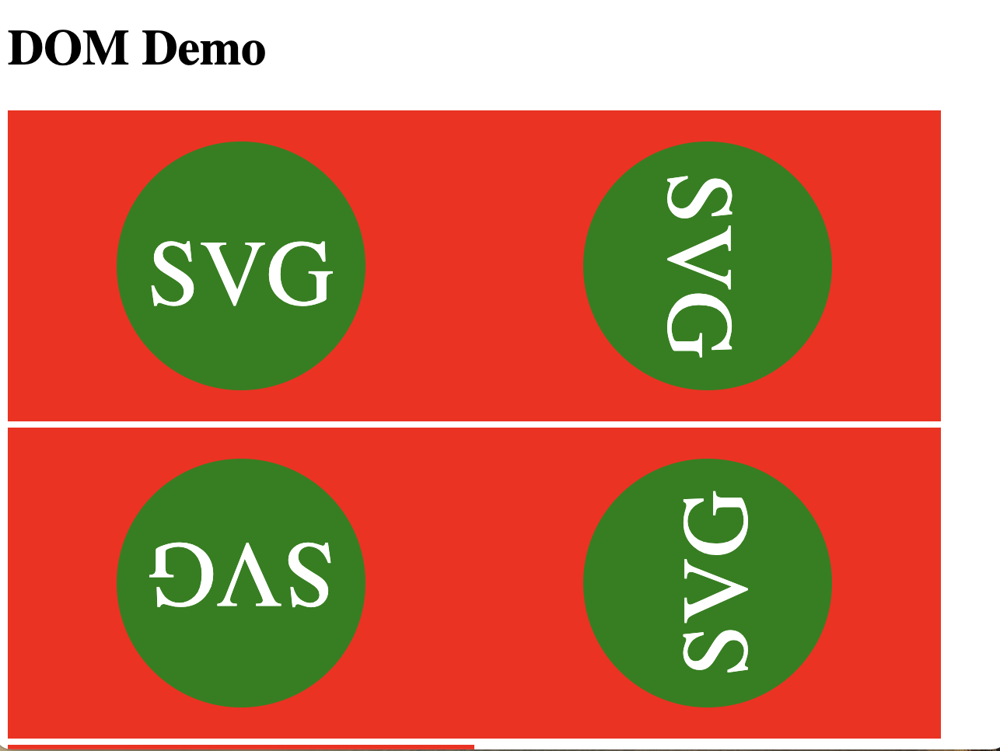
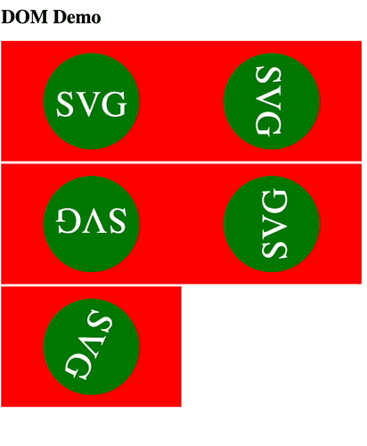

For a project I needed to generate a lot of SVG's both in JS as well as in a backend. I assumed that this could easily be solved by using Kotlin Multiplatform, but I ran into some problems. Eventually I decided to build a minimal DSL to solve the problem I had.

## Generating DOM Documents in JS and the JVM

In this project I needed to _generate_ dynamic SVG files based on some parameters. Since identical images needed to be created in the frontend (JS), as well as in the backend (JVM) and we were already using Kotlin, the obvious choice was just to make a Kotlin Multiplatform library. By [connecting to platform specific api's](https://kotlinlang.org/docs/multiplatform-connect-to-apis.html) I thought I could easily wrap the `Document` API's of both the JVM and the browser.

However, as I soon found out, they aren't completely identical. Besides, I didn't feel like having to create a whole bunch of `expect`/`actual` things for a hiararchy of interfaces. 

I thought Jetbrains already solved this issue with the [kotilinx.html](https://github.com/Kotlin/kotlinx.html) library, but that only focusses on HTML, and not on SVG's or DOM Documents in general.

## Use cases

What I wanted was at least the following:
- Generate DOM elements in the browser
- Generate DOM elements in the backend
- Have the same codebase for both
- Have support for namespaces (for SVG's)
- Have a more ergonomic API than the classical imperative API
- Support a Virtual DOM

## Basic setup

Okay, so I created a new Kotlin Multiplatform library and started working only on the Common module, to be as language agnostic as possible. 

### Definition and writers

The first thing was that I wanted to separate the content or definition of the DOM Document from the actual implementation. I solved this by creating an interface named `Definition` that can write to a `Writer`. They are initially defined as follows:

```kotlin
fun interface Definition {
    fun write(writer: Writer)
}

interface Writer {
    fun beginElement(name: String, namespace: String?)
    fun endElement()

    fun writeAttribute(name: String, value: String)
    fun writeText(text: String)
}
```
The `Definition` interface has only 1 method and can as such be written as a [functional interface](https://kotlinlang.org/docs/fun-interfaces.html). The `Writer` encapsulates the side-effects, whereas the `Definition` contains the structure of the DOM Document.

### Definition Builder DSL

The most important thing to do is to be able to generate a `Definition`. One could just implement them for every DOM Document I want to generate but that makes it very cumbersome and verbose. More interesting would be to create a nice builder DSL that writer to a `Writer` and wire the `Builder` up to a `Definition` later. 

We start with the following `Builder`:
```kotlin
class Builder(
    private val writer: Writer,
    private val namespace: String?
) {
    fun element(name: String, block: Builder.() -> Unit = {}) {
        writer.beginElement(name, namespace)
        block(this)
        writer.endElement()
    }

    fun attribute(name: String, value: String) {
        writer.writeAttribute(name, value)
    }

    fun text(raw: String) {
        writer.writeText(raw)
    }
}
```

The `Builder` requires a `Writer` instance and a `namespace` after which it is possible to write to a `Writer`. This wouldn't be very interesting if it wasn't for the `block: Builder.() -> Unit` arguments in the `element` method. This is a [function literal with a receiver](https://kotlinlang.org/docs/lambdas.html#function-literals-with-receiver), which means that the `this` in the scope of the lambda refers to the `Builder` instance that is passed as first argument. So, we can use it like follows:

```kotlin
val writer: Writer = ...
val builder = Builder(writer, namespace="ns")

with(builder) { // `this` is builder
    element("root") { `this` is builder still
        attribute("foo", "bar")
        element("child")
    }
}

// this translates to:
writer.beginElement("root", "ns")
writer.writeAttribute("foo", "bar", "ns")
writer.beginElement("child")
writer.endElement()
writer.endElement()
```

## Wiring up the Builder to the Definition

It is pretty trivial to add the builder to the definition now:

```kotlin
fun interface Definition {

    fun write(writer: Writer)

    companion object {
        fun build(
            namespace: String?,
            block: Builder.() -> Unit = {}
        ): Definition = Definition { writer ->
            block(Builder(writer, namespace))
        }
    }
}
```

And now we can create a definition like this:

```kotlin
val domDefinition = Definition.build("ns") {
    element("root") { `this` is builder still
        attribute("foo", "bar")
        element("child")
    }
}

// and write to it like this
val writer : Writer = ....
domDefinition.write(writer)
```

## Improving the DSL

It is still a bit verbose, so by modifying the `Builder` we can make it a little bit more ergonomic:

```kotlin
class Builder(
    private val writer: Writer,
    private val namespace: String?
) {

    private fun element(name: String, block: Builder.() -> Unit = {}) {
        writer.beginElement(name, namespace)
        block(this)
        writer.endElement()
    }

    private fun attribute(name: String, value: String) {
        writer.writeAttribute(name, value, namespace)
    }

    fun text(raw: String) {
        writer.writeText(raw)
    }

    // Adding these operator functions
    operator fun String.invoke(block: Builder.() -> Unit = {}) {
        element(this, block)
    }

    operator fun String.invoke(
        vararg args: Pair<String?, Any?>?,
        block: Builder.() -> Unit = {})
    {
        element(this) {
            args.filterNotNull()
                .filter { (name, value) -> name != null && value != null }
                .forEach { (name, value) -> attribute(name!!, value.toString()!!) }
            block(this)
        }
    }
}
```

We are using [extension functions](https://kotlinlang.org/docs/extensions.html) on `String` _inside_ the `Builder` class. We add the `invoke` operator function to `String` which allows us to 'call' `String` inside the scope of `Builder`. Together with `varargs` we have a very simple expressive DSL, whic results into:

```kotlin
val domDefinition = Definition.build("ns") {
    "root" ("foo" to "bar") {
        "child" ("baz" to "bat", "quux" to 1234)
        "single" ()
    }
}
```

Now, by adding some utility functions we can improve our DSL a little more:

```kotlin
fun xml(
    root: String,
    namespace: String?,
    vararg args: Pair<String?, Any?>?,
    block: Builder.() -> Unit = {}
): Definition {
    return Definition.build(namespace) {
        root.invoke(*args, block=block)
    }
}

fun xml(root: String, block: Builder.() -> Unit = {}) = xml(root, namespace=null, args= arrayOf(), block = block)
fun xml(root: String, vararg  args: Pair<String?, Any?>?, block: Builder.() -> Unit = {}) = xml(root, namespace=null, args=args, block = block)

fun svg(
    width: Int?,
    height: Int?,
    viewBox: Boolean = true,
    block: Builder.() -> Unit = {}
): Definition {
    return Definition.build("http://www.w3.org/2000/svg") {
        "svg"(
            "xmlns" to "http://www.w3.org/2000/svg",
            "version" to "1.1",
            "width" to width?.toString(),
            "height" to height?.toString(),
            if (viewBox && width != null && height != null) "viewBox" to "0 0 $width $height" else null,
            block = block
        )
    }
}
```

As can be seen we can now eaily generate XML elements (or SVG) elements using these simple functions:

```kotlin
val test = svg(width = 300, height = 200) {
        "rect" ("width" to "100%", "height" to "100%", "fill" to "red")
        "circle" ("cx" to 150, "cy" to 100, "r" to 80, "fill" to "green")
        "text" ("x" to 150, "y" to 125, "font-size" to 60, "text-anchor" to "middle", "fill" to "white") {
            text("SVG")
        }
    }
```

which will be rendered to:
```xml
<svg version="1.1" width="300" height="200" xmlns="http://www.w3.org/2000/svg">
  <rect width="100%" height="100%" fill="red" />
  <circle cx="150" cy="100" r="80" fill="green" />
  <text x="150" y="125" font-size="60" text-anchor="middle" fill="white">SVG</text>
</svg>
```

To be honest, this isn't necessarily less verbose than XML itself is. But the power comes from the flexibility of creating writers.

## Creating Writers

### Appendable 
The first one is a `common`-module writer which just writer the definition to an `Appendable`:

```kotlin
class AppendableWriter(
    private val appendable: Appendable,
    private val prettyPrint: Boolean,
    private val prettyPrintIndent: Int
) : Writer {
    private val tags = ArrayDeque<String>()
    private val hasChildren = ArrayDeque<Boolean>()
    private var level = 0
    private val indent = if (prettyPrint) " ".repeat(prettyPrintIndent) else ""
    private val newline = if (prettyPrint) "\n" else ""

    override fun beginElement(tag: String, namespace: String?) {
        if (!hasChildren.isEmpty()) {
            val currentHasChildren = hasChildren.removeFirst()
            if (!currentHasChildren) {
                appendable.append(">$newline")
            }
            hasChildren.addFirst(true)
        }

        level += 1
        appendable.append("${indent()}<$tag")
        tags.addFirst(tag)
        hasChildren.addFirst(false)
    }

    override fun endElement() {
        val tag = tags.removeFirst()
        when (hasChildren.removeFirst()) {
            true -> appendable.append("${indent()}</$tag>$newline")
            else -> appendable.append(" />$newline")
        }
        level -= 1
    }

    override fun writeAttribute(name: String, value: String) {
        appendable.append(" $name=\"$value\"")
    }

    override fun writeText(text: String) {
        appendable.append(text)
    }

    private fun indent(): String = indent.repeat(level - 1)
}

// and a convencience extension function:
fun Definition.renderAsString(
    prettyPrint: Boolean = false,
    prettyPrintIndent: Int = 4
): String {
    return StringBuilder().also { builder ->
        this.write(AppendableWriter(builder, prettyPrint, prettyPrintIndent))
    }.toString()
}

// and we can now write:
val test : String = xml(....).renderAsString();
```

This one will now work in _all_ platforms, since it is purely a `common`-module.

### Browser DOM

A writer that is used in the `JS` module only is easily written as well:
```kotlin
import kotlinx.browser.document
import org.w3c.dom.Element

class BrowserWriter : Writer {

    var result: Element? = null
        private set

    private val stack = ArrayDeque<Element>()

    override fun beginElement(name: String, namespace: String?) {
        val element = document.createElementNS(namespace, name)
        stack.firstOrNull()?.appendChild(element)
        stack.addFirst(element)
    }

    override fun endElement() {
        result = stack.removeFirst()
    }

    override fun writeAttribute(name: String, value: String) {
        stack.first().setAttribute(name, value)
    }

    override fun writeText(text: String) {
        stack.first().textContent = text
    }
}

// and a convenience extension function
fun Definition.toElement(): Element = BrowserWriter().also { writer ->
    this.write(writer)
}.result!!

// and we can now write:
val test : Element = svg(....).toElement();
document.body.appendChild(test);
```

We use a simple `ArrayDeque` as a stack here, to keep track of the current element and its parents. We can now test this in our browser eaily by creating a `main` in our JS module and creating an SVG in it.

```kotlin
fun demo(angle: Double): Definition = svg(width = 300, height = 200) {
    "rect" ("width" to "100%", "height" to "100%", "fill" to "red")
    "g" ("transform" to "rotate($angle, 150, 100)") {
        "circle"("cx" to 150, "cy" to 100, "r" to 80, "fill" to "green")
        "text"("x" to 150, "y" to 125, "font-size" to 60, "text-anchor" to "middle", "fill" to "white") {
            text("SVG")
        }
    }
}

fun main() {
    val app = document.getElementById("app")!!

    // render them as normal elements
    repeat(6) { i ->
        app.appendChild(demo(i * 90.0).toElement())
    }
}
```

and this will result in:


### Making a Virtual DOM Writer

The goal was to also support a Virtual DOM, and this can now easily be done by levering a [virtual-dom library](https://github.com/Matt-Esch/virtual-dom).

First we need to add this `npm` dependency in our JS project:
```kotlin
// in our build.gradle.kts
val jsMain by getting {
    dependencies {
        implementation(npm("virtual-dom", "2.1.1"))
    }
}
```

We are going to use the hyperdom-package for generating so-called VNodes. To make this properly work in Kotlin we need to make sure we expose the required functions and classes in Kotlin via externals, which are [pretty well described](https://kotlinlang.org/docs/using-packages-from-npm.html) in the docs. To reference the hyperdom and VNodes we add the following rules to a file:
```kotlin
package externals.virtualDom

import kotlin.js.Json

@JsModule("virtual-dom/vnode/vnode")
@JsNonModule
external interface VNode

@JsModule("virtual-dom/h")
@JsNonModule
external fun h(selector: String, properties: Json = definedExternally, children: Array<dynamic> = definedExternally): VNode

@JsModule("virtual-dom/create-element")
@JsNonModule
external fun createElement(vNode: VNode): Element

external interface Patches

@JsModule("virtual-dom/diff")
@JsNonModule
external fun diff(a: VNode, b: VNode): Patches

@JsModule("virtual-dom/patch")
@JsNonModule
external fun patch(element: Element, patches: Patches): Element
```

and some accompanying extensions to make our life easier:
```kotlin
fun Definition.toVNode(): VNode = VirtualDomWriter().also { writer ->
    this.write(writer)
}.result!!

fun VNode.toElement(): Element = createElement(this)
fun VNode.diff(other: VNode): Patches = externals.virtualDom.diff(this, other)
fun Element.patch(patches: Patches): Element = externals.virtualDom.patch(this, patches)
```

And now, with the magic of a virtual-dom we can make an easy rotating SVG:
```kotlin
var currentAngle = 0.0
var tree = demo(currentAngle).toVNode()
var element = tree.toElement()
app.appendChild(element)

window.setInterval({
    currentAngle += 0.6
    currentAngle %= 360.0
    val newTree = demo(currentAngle).toVNode()
    val patches = newTree.diff(tree)
    element = element.patch(patches)
    tree = newTree
}, 1000 / 60)
```
and this results in:



## Closing remarks

So far I am pretty happy with the results, but there are some caveats of course:
- No escaping at this moment
- No support for events

However, it only took me a short time to come up with something relatively functional in common code, and with heavy flexibility. For me this blog post served more as a brain-dump then something were I explain exactly what I do and why I do it. However, I am always open to questions. So contact me via [e-mail](mailto:info@avwie.nl), Twitter [@avwie](https://twitter.com/avwie), or at [my repository of the coding examples](https://github.com/avwie/scribbles/tree/main/kotlin/dom).