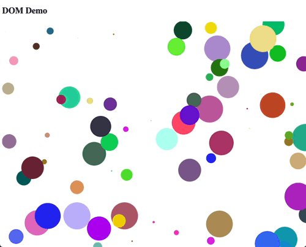

Based on [my previous blog post about a multiplatform DOM DSL](/dom-dsl-in-kotlin) I got some more inspiration. I used an NPM library called [virtual-dom](https://www.npmjs.com/package/virtual-dom) to implement a virtual DOM in the JS part. It got me thinking.... how easy would it be to do it myself? I know virtual DOM libraries are a dime a dozen, and most of them are heavily optimized. It is futile to think I could make something better than say.... React. However, how easy would it be to have something that works _good enough_? Well, as it turned out, it was pretty easy. 

## What is a virtual DOM and why would we need it?
These are very good questions to ask, so it is important to answer them. To start off, it is important to establish what a DOM exactly is. It is a [Document Object Model](https://en.wikipedia.org/wiki/Document_Object_Model) which describes in an object-oriented way how a document (XML or HTML) is structured. It models this as a tree of nodes and attributes.

The upside of using a DOM to render XML (and by extension HTML) documents is that it is a cross-platform method and it maps pretty easily to our mental image of this structure. Also, the methods for manipulating the DOM are more or less the same in every language. This results in the fact that the DOM is also used for rendering the browser contents. Every single HTML tag is a DOM node.

The downside of the DOM in the browser is that it is _slow_ to construct. A single node contains a lot of information and state. It isn't just a simple tag with some attributes. It contains event-handlers, prototype information, methods and what not. Constructing them is expensive. When they are created, and thus allocated, interacting with them is actually pretty fast.

However, in the recent years the interest of some part of the web community has shifted to functional programming (FP). What if we could interact with web pages functionally? What if we could have a dynamic web experience, but functional? This is orthagonal to the OOP way of manipulating the webpage by the DOM methods. In the OOP approach, changes to the state of the application need to be reflected by calling the methods on the DOM elements in the browser. However, in FP we would like to have a _pure_ function (which means it has no side effects) that takes a certain state and returns a result, say HTML. It has a lot of benefits over OOP for complex presentation logic, but it is a bit out of scope for this post. 

The naive thing to do would be to just generate fresh HTML and replace everything inside the browser with the fresh HTML. Like a game would work. Every 1/60th of a second the screen is refreshed and completely redrawn. However, as we just learned, the creation of DOM nodes is slow. So this would make for a very suboptimal solution.

I _think_ it was React (but I might be wrong) that came up with the idea of using a virtual DOM. The general idea is like this: What if we have a way of modelling the DOM using very cheap elements (cheap to allocate in both memory and time) and render that to the browser once. Then, after every application-state change, recreate the virtual DOM (cheap), and compare the new virtual DOM with the old one and only update the actual elements in the browser that are different between the old and the new virtual DOM. This process is called [reconciliation by React](https://reactjs.org/docs/reconciliation.html). 

## Creating a virtual DOM representation

### Nodes 
So how are we going to do this in Kotlin Multiplatform? We start with a common module and create the basic definition of a node:
```kotlin
data class Node(
    val name: String,
    val attributes: Map<String, String>,
    val childNodes: List<Node>,
    val namespace: String?,
    val text: String?
)
```

If you read any of my previous posts you know I like to build DSL's to make constructing things like this easy. So I've extended it a bit further with some helper class and some helper functions:

```kotlin
// in class Node
class BuilderScope(private val name: String, var namespace: String? = null) {

    val attributes = mutableMapOf<String, String>()
    val children = mutableListOf<Node>()
    var text: String? = null

    fun build(): Node = Node(name, attributes, children, namespace, text)

    fun node(name: String, block: BuilderScope.() -> Unit = {}) {
        val builder = BuilderScope(name, namespace)
        block(builder)
        children.add(builder.build())
    }

    operator fun String.invoke(block: BuilderScope.() -> Unit = {}) = node(this, block)

    infix fun String.by(value: String) {
        attributes[this] = value
    }

    operator fun String.unaryPlus() {
        text = this
    }
}

fun node(name: String, namespace: String? = null, block: Node.BuilderScope.() -> Unit): Node {
    val scope = Node.BuilderScope(name, namespace)
    block(scope)
    return scope.build()
}

fun html(block: Node.BuilderScope.() -> Unit) = node("html", "http://www.w3.org/1999/xhtml", block)

fun svg(block: Node.BuilderScope.() -> Unit) = node("svg", "http://www.w3.org/2000/svg") {
    attributes["version"] = "1.1"
    block()
}
```

And this allows us to use a very fancy DSL to create our nodes:
```kotlin
fun demo(rotation: Int) = svg {
    "width" by "300"
    "height" by "200"

    "rect" { // courtesy of the 'String.invoke'
        "width" by "100%" // courtesy of the 'infix fun String.by'
        "height" by "100%"
        "fill" by "red"
    }

    "circle" {
        "cx" by "150"
        "cy" by "100"
        "r" by "80"
        "fill" by "green"
    }

    "text" {
        "transform" by "rotate($rotation, 150, 100)"
        "x" by "150"
        "y" by "125"
        "font-size" by "60"
        "text-anchor" by "middle"
        "fill" by "white"
        + "SVG" // courtesy of the 'operator fun String.unaryPlus()'
    }
}
```

### Attaching the virtual DOM to the actual DOM

We have a tree of nodes, but we still need to render them to screen and somehow relate the `Node` to an actual element. Since I want to keep most of my code platform-agnostic I try to keep everything in the common module and implement platform specific code via the `actual / expect` mechanism or via plain old interfaces.

In this code I decided to link the `Node` to an platform specific "element" by creating a `Mounted<T>` data class, which implies that the `Node` is mounted to _some_ `T`.

```kotlin
data class Mounted<T>(val element: T, val container: T?, val node: Node, val childNodes: List<Mounted<T>>)
```

In this case the `container` is the _parent_ element. It can be `null` because the top-level node (e.g. `html`) won't have a container.

Now, to actually perform reconciliation we need to have some way of manipulating the target DOM. I call this a `Target<T>`, which should be an interface which implements the minimal set of methods for doing all the required tasks of reconciling the virtual DOM with the actual DOM.

```kotlin
interface Target<T> {
    fun createElement(name: String, namespace: String?): T
    fun setAttribute(element: T, key: String, value: String)
    fun setText(element: T, text: String?)
    fun appendChild(container: T?, child: T)
    fun remove(element: T)
    fun removeAttribute(element: T, key: String)
}
```

### Reconciliation

We now can create a class, `Renderer<T>` in this case, which does all the 'heavy lifting' of the reconciliation, given a certain `Node` and a `Target<T>`.

```kotlin
class Renderer<T>(private val target: Target<T>) {
    private var root: Mounted<T>? = null
    val rootElement get() = root?.element

    fun render(node: Node) {
        root = root?.let { updateNode(it, node) } ?: mount(node, null)
    }
}
```

So, when the `root` is `null` it means there is nothing mounted yet, so we mount the current node, otherwise we update it. Afterwards we set the `root` item to the new `Mounted` node.

#### Mounting
Mounting is easy and is written as a simple function that mounts the node and it's children by rendering each `Node` to the `Target<T>`.
```kotlin
class Renderer<T> {
    // ..
    private fun mount(node: Node, container: T?): Mounted<T> {
        val element = renderNodeWithoutChildren(node)
        val mountedChildren = node.childNodes.map { mount(it, element) }
        target.appendChild(container, element)
        return Mounted(element, container, node, mountedChildren)
    }

    private fun renderNodeWithoutChildren(node: Node): T {
        val element = target.createElement(node.name, node.namespace)
        node.attributes.forEach { (key, value) ->
            target.setAttribute(element, key, value)
        }
        target.setText(element, node.text)
        return element
    }
}
```
Afterwards we'll have a full tree of `Mounted<T>` classes which relate a `Node` to an actual DOM element `T`.

#### Updating

When updating we need to update _a_ `Mounted<T>` with the new information in a new `Node`.

```kotlin
class Render<T> {
    // ..
    private fun updateNode(current: Mounted<T>, updated: Node): Mounted<T> {
        return when {
            current.node == updated -> current
            current.node.name != updated.name -> replaceNode(current, updated)
            else -> updateNodeDetailed(current, updated)
        }
    }
}
```

We distinguish 3 separate cases here:
1. The current node and the updated node are the same. We just return the current and don't update anything. Please note the `==` works here because we use `data` classes and the `equals` is done by contents and not by reference. This is similar to `case` classes in Scala.
2. The name (or tag) is different. There is no way to reconcile this apart from fully replacing the node.
3. They are different and not just by name, we need to do a detailed update.

When we are doing a detailed update it is actually only based on 3 different changes: attributes, text content and children:

```kotlin
class Render<T> {
    // ..
    private fun updateNodeDetailed(current: Mounted<T>, updated: Node): Mounted<T> {
        return current
            .let { updateAttributes(it, updated)}
            .let { updateText(it, updated) }
            .let { updateChildren(it, updated) }
    }

    private fun updateAttributes(current: Mounted<T>, updated: Node): Mounted<T> = when (current.node.attributes) {
        updated.attributes -> current
        else -> {
            val leftKeys = current.node.attributes.keys.toSet()
            val rightKeys = updated.attributes.keys.toSet()

            val toRemove = leftKeys - rightKeys
            val toSet = rightKeys.filter { current.node.attributes[it] != updated.attributes[it] }

            toRemove.forEach { target.removeAttribute(current.element, it) }
            toSet.forEach { target.setAttribute(current.element, it, updated.attributes[it]!!) }
            current.copy(node = current.node.copy(attributes = updated.attributes))
        }
    }

    private fun updateText(current: Mounted<T>, updated: Node): Mounted<T> = when (current.node.text) {
        updated.text -> current
        else -> {
            target.setText(current.element, updated.text)
            current.copy(node = current.node.copy(text = updated.text))
        }
    }

    private fun updateChildren(current: Mounted<T>, updated: Node): Mounted<T> {
        val indices = (0 until max(current.childNodes.size, updated.childNodes.size))
        val mountedChildren = indices.mapNotNull { i ->
            val mountedChild = current.childNodes.getOrNull(i)
            val updatedChild = updated.childNodes.getOrNull(i)
            updateChild(current.container, mountedChild, updatedChild)
        }
        return current.copy(childNodes = mountedChildren)
    }
}
```

The `updateAttributes` and `updateText` are pretty straightforward. The `updateChildren` however requires some more explanation. I am using a **very naive** approach of matching the nodes purely by index in the `childNodes` list. This means I **do not take reordering** into account at all. I think I'll add it later, but I wanted to have everything working first.

The `updateChild` method is implemented as follows:
```kotlin
class Renderer<T> {
    // ..
    private fun updateChild(container: T?, mounted: Mounted<T>?, updated: Node?): Mounted<T>? = when {
        mounted == null && updated != null -> mount(updated, container)
        mounted != null && updated == null -> {
            target.remove(mounted.element)
            null
        }
        mounted == null && updated == null -> null // for completeness... should not happen
        else -> updateNode(mounted!!, updated!!)
    }
}
```

When `updated` is added we should `mount` it. If `updated` is `null` and thus removed, we should remove it. Otherwise we should recursively call the `updateNode` method again.

#### Implementing a Browser target

The browser target is now made by just implementing `Target<Element>` where `Element` refers to the `org.w3c.dom.Element`.

```kotlin
class BrowserDocumentTarget(private val root: Element) : Renderer.Target<Element> {

    override fun createElement(name: String, namespace: String?): Element {
        return document.createElementNS(namespace, name)
    }

    override fun setAttribute(element: Element, key: String, value: String) {
        element.setAttribute(key, value) // <- this is waaay faster somehow. Reported to JetBrains.
    }

    override fun setText(element: Element, text: String?) {
        element.textContent = text
    }

    override fun appendChild(container: Element?, child: Element) {
        (container ?: root).appendChild(child)
    }

    override fun remove(element: Element) {
        element.remove()
    }

    override fun removeAttribute(element: Element, key: String) {
        element.removeAttribute(key)
    }
}
```

Well, this is pretty straightforward. It feels a bit redundant, but it is a small price I like to pay to keep most of the stuff platform-agnostic.

### Demo

We can now our virtual DOM for a test ride by making a bunch of bouncing balls. I am just dumping the full code of the example here, because it is basically pretty straightforward. Nevertheless, in short, the following happens:

1. A state `S` is initialized
2. A `render` function transforms the state to a `Node`
3. An `update` function updates the state
4. An interval is started of 60Hz
5. Every tick the state is recalculated and a new `Node` tree is rendered to screen

```kotlin
data class Dynamics(val x: Double, val y: Double, val dx: Double, val dy: Double)
data class Color(val red: Int, val green: Int, val blue: Int) {
    private fun Int.hex(): String = this.toString(16).padStart(2, '0')
    fun hex(): String = "#${red.hex()}${green.hex()}${blue.hex()}"
}
data class Ball(val dynamics: Dynamics, val radius: Double, val color: Color)
data class Area(val width: Double, val height: Double)
data class State(val area: Area, val balls: List<Ball>)

fun initState(noOfBalls: Int, width: Double, height: Double): State = State(
    area = Area(width, height),
    balls = (0 until noOfBalls).map {
        Ball(
            dynamics = Dynamics(
                x = Random.nextDouble(width),
                y = Random.nextDouble(height),
                dx = Random.nextDouble(-1.0, 1.0) * width / 5000.0,
                dy = Random.nextDouble(-1.0, 1.0) * height / 5000.0
            ),
            radius = Random.nextDouble(minOf(width, height) / 20),
            color = Color(
                red = Random.nextInt(256),
                green = Random.nextInt(256),
                blue = Random.nextInt(256)
            )
        )
    }
)

fun renderState(state: State) = svg {
    "width" by state.area.width.toString()
    "height" by state.area.height.toString()

    state.balls.forEach { ball ->
        "circle" {
            "cx" by ball.dynamics.x.toString()
            "cy" by ball.dynamics.y.toString()
            "r" by ball.radius.toString()
            "fill" by ball.color.hex()
        }
    }
}

fun walls(u: Double, du: Double, limit: Double): Pair<Double, Double> = when {
    u < 0 -> abs(u) to -du
    u > limit -> limit - (u - limit) to -du
    else -> u to du
}

fun updateState(state: State, dt: Double): State = state.copy(
    balls = state.balls.map { ball ->
        val (x0, y0, dx0, dy0) = ball.dynamics
        val (x1, dx1) = walls(x0 + dx0 * dt, dx0, state.area.width)
        val (y1, dy1) = walls(y0 + dy0 * dt, dy0, state.area.height)
        ball.copy(
            dynamics = Dynamics(x1, y1, dx1, dy1)
        )
    }
)

data class Update<S>(
    val state: S,
    val render: (S) -> Node,
    val update: (S) -> S,
    val renderer: Renderer<Element>,
) {
    fun next(): Update<S> {
        val newState = update(state)
        val newVDom = render(newState)
        renderer.render(newVDom)
        return copy(
            state = newState,
        )
    }

    companion object {
        fun <S> build(mount: Element, initialState: S, render: (S) -> Node, update: (S) -> S): Update<S> {
            val vDom = render(initialState)
            val target = BrowserDocumentTarget(mount)
            val renderer = Renderer(target)
            renderer.render(vDom)
            return Update(initialState, render, update, renderer)
        }
    }
}

fun main() {
    val container = document.getElementById("app")!!
    val dt = 1000 / 60
    var updater = Update.build(
        mount = container,
        initialState = initState(100, 1280.0, 1024.0),
        render = { state -> renderState(state) },
        update = { state -> updateState(state, dt.toDouble()) }
    )

    window.setInterval({ updater = updater.next() }, dt)
}
```

And this results in the following nice animation (please note, the GIF's FPS is turned waaaaaay down). It runs at a smooth 60FPS, although the GIF doesn't make that immediately clear:



## Conclusion

This was a fun exercise again and I learned a lot, however there are some things I want to improve:
1. Events: Currently I have no event support, that needs to be added.
2. Lazy node evaluation: It isn't necessary to reconstruct the whole node tree. It can be done lazily if the inputs are changed.
3. Take order into account

I had a lot of fun coding this and I hope you learn something. If you want to ask questions, don't hesitate to contact me via Twitter [@avwie](https://twitter.com/avwie), or look at [my repository of the coding examples](https://github.com/avwie/scribbles/tree/532982fc6809a20511fee8927c9142a14a0066ec). 