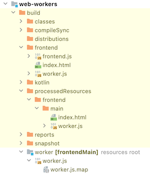
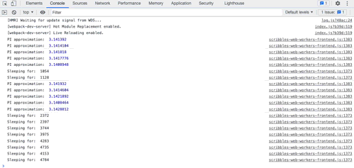

One of the things that always interested me, but so far I never have used, are [Web Workers](https://developer.mozilla.org/en-US/docs/Web/API/Web_Workers_API/Using_web_workers). To quote the MDN documentation here:

> _"Web Workers are a simple means for web content to run scripts in background threads."_

This interests me, because the browser context is inherently single-threaded. Async behavior is implemented by an event-loop, but it is not possible to parallel computations inside a single scripts.

Web Workers solve this and this means it should also be possible to get this behavior in Kotlin, however it requires some tricks. Nevertheless I am quite happy with the result.

## Separate compilations

The biggest challenge I was facing was how to organize it in my project. I worked with Multiplatform projects before, but I always just used the standard settings, and I find Gradle.... challenging. Besides that, the Kotlin Mulitplatform Gradle plugin is also a complicated beast.

The big difference between multithreading in a 'normal' application (e.g. Java, C#, Rust etc) is that you can spin up threads from within your code _and_ pass data to this thread. They all run in the same codebase and compilation unit. In browserworld however, with Web Workers, you need to launch a Worker by passing it a script file the worker should run _and_ this script runs in a different environment than a normal browser script. A worker is launched in JS via `new Worker("worker.js")` where `worker.js` is your separate script with the worker code. This `Worker` runs in a `DedicatedWorkerGlobalScope`, which means that all the normal stuff, like `document` and `window` aren't available. Besides that, sending and receiving data is handled via message passing. Most JS objects can pass through this message-bus, but since we are using Kotlin (compiled to JS), we can't be entirely sure how the compiler handles this. So we need to be very certain about what data we pass around.

What is clear is that we need a project with **two** Javascript targets in them. One is the _frontend_ and one is the _worker_. An issue with MPP programming is that the Gradle distribution tasks tends to throw everything in the `distribution` folder and name everything the same (the name of the project).

However, I came up with the following solution:

```kotlin
// build.gradle.kts
kotlin {
    js("worker", IR) {
        binaries.executable()
        browser {
            webpackTask {
                outputFileName = "worker.js"
            }
            distribution {
                name = "worker"
            }
        }
    }

    js("frontend", IR) {
        binaries.executable()
        browser {
            runTask {
                outputFileName = "frontend.js"
            }

            webpackTask {
                outputFileName = "frontend.js"
            }

            distribution {
                name = "frontend"
            }
        }
    }

    // sourceSets etc
}
```

And after building we have two separate JS files living in separate folders. 

However, when running the frontend code via `frontendBrowserDevelopmentRun` it can not access the `worker.js` file. Therefore we need to add a dependency to that file via the resource. What I did as solutions was:

- Frontend depends on worker.js to be ready
- Make sure worker is build before processing the resources of frontend
- Add the build worker.js as a resource to the frontend target

This is done like this in the build file:
```kotlin
kotlin {
    sourceSets {
        // ...

        val frontendMain by getting {
            resources.srcDirs("./build/worker")
        }
    }
}

tasks["frontendProcessResources"].dependsOn.add("workerBrowserDistribution")
```

What we have achieved with these few lines is that the `./build/worker` directory (where the output of the distribution task of the worker JS module is moved to) is added to the resources of the frontend module. During the `processResources` task of the frontend module, all the related resources are moved to root of the output directory of the frontend module.

And, if we look to the output after running the `build` task of frontend, we see the following:



In the _frontend_ folder we now see all the required files.

## Wrapping the Web Worker messaging API into coroutines

Communicating to Web Workers goes via a simple messaging API:

```kotlin
public external open class Worker(scriptURL: String, options: WorkerOptions = definedExternally) : EventTarget, AbstractWorker {
    var onmessage: ((MessageEvent) -> dynamic)?
    override var onerror: ((Event) -> dynamic)?
    fun terminate()
    fun postMessage(message: Any?, transfer: Array<dynamic> = definedExternally)
}
```

This means that in order to have a request/response dynamic we need to work with some sort off callback mechanism:
- first establish what should happen _on_ a message _from_ the worker via `onmessage`
- then send a message via `postMessage`

Working with callbacks feels a bit wrong when you have a nice coroutine library available in Kotlin. Luckily it is quite a breeze to wrap this in a coroutine via the `suspendCoroutine` function, where we can hook into the current running coroutine.

By creating a nice extension function on `Worker` we are able to create a suspending function which does the heavy lifting:
```kotlin
suspend fun Worker.send(data: String) = suspendCoroutine<MessageEvent> { continuation ->
    this.onmessage = { messageEvent ->
        continuation.resume(messageEvent)
    }
    this.onerror = { event -> continuation.resumeWithException(WorkerException(event.type))}
    this.postMessage(data)
}
```

We use `send` to send basic `String` data to the worker and return a `MessageEvent` (the original API) when the Worker responds.

## Implementing the Worker

Creating the Worker also requires some tricks. First of all, we need to check if we are in a `WorkerGlobalScope` or in the normal browser scope. If the latter is the case the script can not be used. Secondly, if we are in the `WorkerGlobalScope` we need to get a reference to `self`. The Kotlin/JS library doesn't support it. Luckily for us it is pretty simple to implement.

After that we also need to wrap the `onmessage` API of the `Worker`. I made the `block` function suspending, so we are allowed to run suspending functions in there:

I poured it all into one class and created a nice helper function:
```kotlin
fun worker(block: WorkerScope.() -> Unit) {
    val isWorkerGlobalScope = js("typeof(WorkerGlobalScope) !== \"undefined\"") as? Boolean  ?: throw IllegalStateException("Boolean cast went wrong")
    if (!isWorkerGlobalScope) return

    val self = js("self") as? DedicatedWorkerGlobalScope ?: throw IllegalStateException("DedicatedWorkerGlobalScope cast went wrong")
    val scope = WorkerScope(self)
    block(scope)
}

class WorkerScope(private val self: DedicatedWorkerGlobalScope) {
    val workerId = URLSearchParams(self.location.search).get("id") ?: "Unknown worker"

    fun receive(block: suspend (String) -> String) {
        self.onmessage = { messageEvent ->
            GlobalScope.launch {
                self.postMessage(block(messageEvent.data.toString()))
            }
        }
    }
}
```

The `isWorkerGlobalScope` checks if `WorkerGlobalScope` is `undefined` or not. If it is `true` it means that we are in a valid worker scope. After that it is important to get the `self`. We just use the simple `js(...)` trick here also to execute some raw Javascript.
A small trick I added is to add an identifier to the worker by passing an `id` query parameter to the script.

## Wiring it up

We can now implement a simple ping as follows:
```kotlin
// frontend
fun main() {
    GlobalScope.launch {
        val worker = Worker("./worker.js?id=ping-server")
        console.log(worker.send("PING!").data.toString())
    }
}

// worker
fun main() = worker {
    receive { data ->
        delay(1000)
        "Sending back from $workerId: $data"
    }
}
```

And after running `frontendBrowserDevelopmentRun` we get the following happy console message after 1000ms:

`Sending back from ping-server: PING!`

## Creating a Worker Pool

One of things that I really wanted to try was to create some sort of Worker Pool. A group of workers which I can send a message to and it gets distributed between the non-busy workers. This proved to be very easy actually. The most important thing here was that I needed a way to save the request on some queue and attach to this request the information of the coroutine that send this request. Since this is pretty similar as registering a callback somewhere we could just use the `suspendCoroutine` function again. The worker pool is implemented like this:

```kotlin
class WorkerPool(size: Int, private val workerScript: String) {

    // this class stores the request to send _and_ the continuation token of the `suspendCoroutine` function. When the worker returns, it continues the coroutine owning the token.
    data class Job(val data: String, val continuation: Continuation<String>) {
        suspend fun execute(worker: Worker) {
            try {
                val response = worker.send(data)
                continuation.resume(response.data.toString())
            } catch (t: Throwable) {
                continuation.resumeWithException(t)
            }
        }
    }

    private val availableWorkers = ArrayDeque<Worker>()
    private val jobs = ArrayDeque<Job>()

    init {
        repeat(size) { nr ->
            availableWorkers.addLast(Worker("$workerScript?id=Worker-$nr"))
        }
    }

    // when sending data to the pool, we just put it in the queue and check if there is work to do for the pool
    suspend fun send(data: String) = suspendCoroutine<String> { continuation ->
        jobs.addLast(Job(data, continuation))
        checkAvailableWork()
    }

    // the main function. It removes the amount of available workers and jobs from the queues and launches the jobs with the available worker.
    private fun checkAvailableWork() {
        if (jobs.isEmpty() || availableWorkers.isEmpty()) return
        val noOfMessages = min(jobs.size, availableWorkers.size)
        val work = (0 until noOfMessages).map { jobs.removeFirst() to availableWorkers.removeFirst() }
        work.forEach { (job, worker) ->
            GlobalScope.launch {
                job.execute(worker)
                availableWorkers.addLast(worker)
                // after finishing the job, it is important that we check if there is still work remaining
                checkAvailableWork() 
            }
        }
    }
}
```

We can now easily launch 50 Ping requests to a pool, like this:
```kotlin
fun main() {
    val pool = WorkerPool(10, "./worker.js")
    repeat(50) { i ->
        GlobalScope.launch {
            console.log(pool.send("Ping $i"))
        }
    }
}
```

And the console output is as follows:


As can be seen, the workers are running parallel, and are being reused!

## A type-safe request/response mechanism

For now we made the bare minimum of sending `String` data. However, it is much interesting to have some sort of type-safe request/response mechanism, where actually some jobs can be launched. By using the `kotlinx.serialization` library we can pass these messages easily over the worker-boundary.

To do this I created a simple messaging hierarchy in the `common` module, so both frontend and worker can use it:

```kotlin
@Serializable sealed interface Message
@Serializable sealed interface Request<R : RequestResult> : Message
@Serializable sealed interface RequestResult : Message
@Serializable data class Response(val workerId: String, val result: RequestResult? = null, val error: String? = null): Message

@Serializable data class Sleep(val ms: Long): Request<SleepResult>
@Serializable data class SleepResult(val ms: Long): RequestResult

@Serializable data class PIApproximation(val iterations: Int) : Request<PIApproximationResult>
@Serializable data class PIApproximationResult(val pi: Double) : RequestResult
```

We have the high-level interface `Message`. A `Request` has a type parameter `R` which is the response type, which should be of `RequestResult` type. The `Response` contains the actual response being send back.
The `Sleep` and `PIApproximation` requests are just some examples I'll implement later in the worker.

First we need to implement a way to handle the request data to send to the worker. This is pretty easy with the serialization library:

```kotlin
@Suppress("UNCHECKED_CAST")
suspend fun <R : RequestResult> Worker.request(request: Request<R>): R {
    val data = Json.encodeToString(request as Request<RequestResult>)
    val messageEvent = send(data)
    val response = Json.decodeFromString<Response>(messageEvent.data.toString())

    if (response.error != null) throw WorkerException(response.error)
    return response.result as R
}
```

Since we know that we send a request with a response type `R` we can safely cast it to `R` if we don't get any errrors.

In the worker code we can just add an extra method to the `WorkerScope` class:
```kotlin
class WorkerScope {
    // ...
    fun receiveRequest(block: suspend (request: Request<*>) -> RequestResult) = receive { data ->
        val message = Json.decodeFromString<Message>(data)
        val response = try {
            val result = block(message as Request<*>)
            Response(workerId = workerId, result = result, error = null)
        } catch (e: Throwable) {
            Response(workerId = workerId, result = null, error = e.message)
        }
        Json.encodeToString(response)
    }
}
```

And if we want to use the WorkerPool we can also extend that one:
```kotlin
class WorkerPool {
    // ...
    @Suppress("UNCHECKED_CAST")
    suspend fun <R : RequestResult> request(request: Request<R>): R {
        val data = Json.encodeToString(request as Request<RequestResult>)
        val response = send(data)
        val deserialized = Json.decodeFromString<Response>(response)
        return deserialized.result as R
    }
}
```

And now we can use our new type-safe request/response system like this:
```kotlin
// frontend
fun main() {
    val pool = WorkerPool(10, "./worker.js")
    repeat(20) { i ->
        GlobalScope.launch {
            when {
                i % 2 == 0 -> console.log("PI approximation: ", pool.request(PIApproximation(10000000)).pi)
                else -> console.log("Sleeping for: ", pool.request(Sleep(Random.nextLong(500, 5000))).ms.toString())
            }
        }
    }
}

// worker
fun main() = worker {
    receiveRequest { request ->
        when (request) {
            is PIApproximation -> PIApproximationResult(approximatePI(request.iterations))
            is Sleep -> {
                delay(request.ms)
                SleepResult(request.ms)
            }
        }
    }
}
```

And when looking into our console output we get the following:



Everything is working!

## Conclusion

This was a very nice proof-of-concept to work out. I ran into quite a few problems with configuring Multiplatform projects, but the people from Jetbrains are always very very helpful in the Slack channels. Most of the time it was my fault, but I found a bug in their Gradle plugin. Nevertheless, I really enjoyed to built this. Especially the wrapping of the callback code into coroutines made this look pretty elegant.

I think this has potential, but there is a huge drawback when using coroutines and serialization in Kotlin/JS. The package-sizes are becoming huge. Both the `frontend.js` and `worker.js` files are ~500kB in size _after_ dead code elimination and minifying.... So there's definitely some improvements to be had.

If you want to ask questions, don't hesitate to contact me via Twitter [@avwie](https://twitter.com/avwie), or look at [my repository of the coding examples](https://github.com/avwie/scribbles/tree/ff779032f8afda5c862f12151612a6afaea02b9d). 