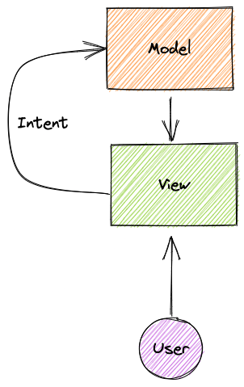
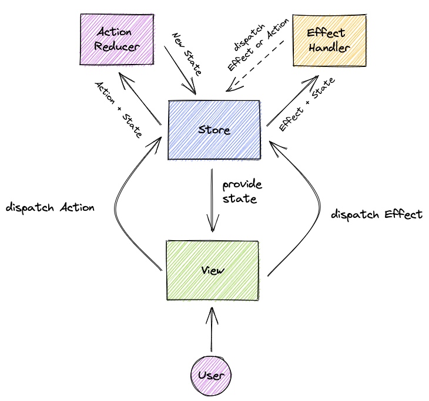
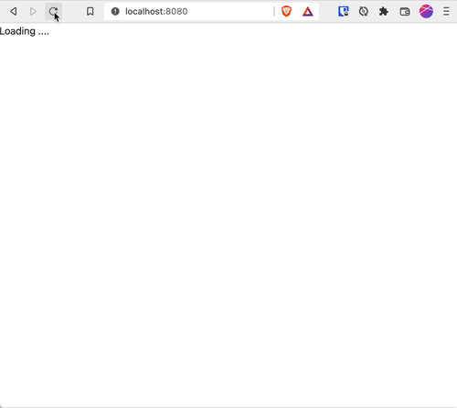

Recently I've gotten very interested in Jetpack Compose. I mistakenly thought it was _just_ a way of declaratively building a UI and having it automatically updated in some clever way. Much like [my own virtual DOM implementation](/virtual-dom-in-kotlin) but more sophisticated. However, I couldn't have been more wrong. It is an extremely advanced reactive and declarative tree-management runtime which takes full advantage of coroutines and other advanced Kotlin features. It is an extremely ambitious project by the Google and Kotlin teams. The Snapshot system is very intriguing way to solve state and I can highly recommend reading [this series on how Compose handles state](https://dev.to/zachklipp/series/12895), an amazing high quality set of blog posts.

There are a multitude of ways of handling your state in a UI built with Compose and [the documentation is pretty clear about it](https://developer.android.com/jetpack/compose/state). However, lately I am also very interested in a Model-View-Intent (or Model-View-Update for Elm people, please correct me if I am wrong) architecture. And this blog post serves as a way of describing how I built something simple like this in Kotlin Multiplatform with Jetpack Compose. People who know Redux-like systems will notice some obvious similarities.

## Model-View-Intent

Well, as usual, the definitions differ if you look on the web. But the most common description is as follows:

- There is a `Model` which represents the state of your application
- There is a `View` which renders the `Model` to the user
- There is an `Intent` which can be initiated by the user by engaging with the `View`
- The `Intent` triggers an update of the `Model`
- Ideally everything is functional, and without side-effects

So, schematically it is something like this (schematics courtesy of the amazing [Excalidraw](https://excalidraw.com/)):



But what is an `Intent`? It is an _intent to change the model_. But an _intent to change_ can be immediate (e.g. updating the model following a button press) or delayed (e.g. doing a request to a server and based on that update the model again). Based on this distinction, and what I've seen in other architectures, I have decided to go for a different naming scheme and some other tweaks to the definitions:

- A `Store` contains the current `State`. This is the original `Model`
- The `View` is still the same and models a UI based on the `State` received from the `Store`
- The `View` can `dispatch` an `Intent` on the `Store` but the `Intent` is now either an `Action` or an `Effect`
- An `Action` will result in a new `State` the `Store` using an `ActionReducer`
- An `Effect` will result in a separate routine to be launched which executes the `Effect` and based on that optionally dispatch some other `Action` or `Effect`

So, the schematic is now updated like this:



### Coding it up

To code this up I don't want to be limited to any platform-specifics, so as always I try to keep it as platform agnostic as possible and will work in some common code first. First let's layout the contracts:

```kotlin
interface ActionDispatcher<A> {
    fun dispatchAction(action: A)
}

interface EffectDispatcher<E> {
    fun dispatchEffect(effect: E)
}

interface Dispatcher<A, E> : ActionDispatcher<A>, EffectDispatcher<E>
```

However, I was talking about the `Effect` being handled in a separate routine. This sounds like a job for coroutines, so I'll add another interface to handle this case. The non-suspending one will come handy later.

```kotlin
interface SuspendingEffectDispatcher<E> {
    suspend fun dispatchEffect(effect: E)
}

interface SuspendingDispatcher<A, E> : ActionDispatcher<A>, SuspendingEffectDispatcher<E>

interface Store<S, A, E> : SuspendingDispatcher<A, E> {
    val state: StateFlow<S>
}
```

As can be seen we are using the [StateFlow](https://kotlin.github.io/kotlinx.coroutines/kotlinx-coroutines-core/kotlinx.coroutines.flow/-state-flow/) here to represent `State`. It plays very well with Compose and is a good way to represent changing state.

And finally we also need to define the action reducer and effect handler:
```kotlin
fun interface ActionReducer<S, A> {
    fun handleAction(state: S, action: A): S
}

fun interface EffectHandler<S, A, E> {
    suspend fun handleEffect(
        state: StateFlow<S>,
        effect: E,
        suspendingDispatcher: SuspendingDispatcher<A, E>
    )
}
```

As can be seen, the `EffectHandler` gets a reference to the `StateFlow`. This makes sure it only reads the state at the moment it requires it and not the state it was provided with.

Wiring up everything in an implementation of `Store` is now trivially simple:
```kotlin
class StoreImpl<S, A, E>(
    initialState: S,
    private val actionReducer: ActionReducer<S, A>,
    private val effectHandler: EffectHandler<S, A, E>,
) : Store<S, A, E> {

    private val _state = MutableStateFlow(initialState)
    override val state = _state.asStateFlow()

    override fun dispatchAction(action: A) {
        _state.update { state -> actionReducer.handleAction(state, action) }
    }

    override suspend fun dispatchEffect(effect: E) {
        effectHandler.handleEffect(state, effect, this@StoreImpl)
    }
}

// and to construct it from a Store:
interface Store<S, A, E> : SuspendingDispatcher<A, E> {
    val state: StateFlow<S>

    companion object {
        operator fun <S, A, E> invoke(
            initialState: S,
            actionReducer: ActionReducer<S, A>,
            effectHandler: EffectHandler<S, A, E>
        ): Store<S, A, E> = StoreImpl(initialState, actionReducer, effectHandler)
    }
}
```

### Testing it

This was pretty simple to program, so it is important to test it as well. To do this we create a `common` test and we will be using the `runTest` facility provided by the `org.jetbrains.kotlinx:kotlinx-coroutines-test` module.

First we define our actions and effects as algebraic data types:
```kotlin
sealed interface Action {
    object Uppercase : Action
    object Lowercase: Action
    object Reverse: Action
}

sealed interface Effect {
    data class DelayedAction(val delay: Long, val action: Action) : Effect
}
```

Then we define our reducer and our handler
```kotlin
private val actionReducer = ActionReducer<String, Action> { state, action ->
    when (action) {
        Action.Uppercase -> state.uppercase()
        Action.Lowercase -> state.lowercase()
        Action.Reverse -> state.reversed()
    }
}

private val effectHandler = EffectHandler<String, Action, Effect> { _, effect, dispatcher ->
    when (effect) {
        is Effect.DelayedAction -> {
            delay(effect.delay) // we are in a suspend function so we can use delay
            dispatcher.dispatchAction(effect.action)
        }
    }
}
```

Finally we test everything with the [`runTest`](https://kotlin.github.io/kotlinx.coroutines/kotlinx-coroutines-test/kotlinx.coroutines.test/run-test.html) function. This takes care of the heavy lifting and does some fancy pantsy things with delays. It is important to read the documentation about it.
```kotlin
@Test
fun testActionsAndEffect() = runTest {
    val store = Store("foo", actionReducer, effectHandler)
    assertEquals("foo", store.state.value)

    store.dispatchAction(Action.Uppercase)
    assertEquals("FOO", store.state.value)

    store.dispatchAction(Action.Lowercase)
    assertEquals("foo", store.state.value)

    store.dispatchEffect(Effect.DelayedAction(2000, Action.Reverse))
    assertEquals("oof", store.state.value)
}
```

However, to be extra extra sure the effect actually fires in a separate coroutine, lets write another test to show that it actually delays:
```kotlin
@Test
fun testLaunch() = runTest {
    val store = Store("foo", actionReducer, effectHandler)

    launch {
        store.dispatchEffect(Effect.DelayedAction(2000, Action.Reverse))
        assertEquals("oof", store.state.value) // this is in same coroutine as the effect, so this will run after 2000ms
    }
    assertNotEquals("oof", store.state.value) // this runs directly after launching the coroutine, so it will still be "foo"
    advanceUntilIdle() // a convenience function that waits until all tasks are completed
    assertEquals("oof", store.state.value) // all tasks in the coroutine are completed and the value is reversed
}
```

And this works as expected!

## Creating an XKCD comic browser in Compose for Web

So now it is time to create a very simple web application using this architecture. I have chosen to go for a simple web application that shows XKCD comics via [this API](https://xkcd.vercel.app/).

I want to be able to do the following:
- Get the latest comic
- Get the next one
- Get the previous one
- Get a random one

### Creating the Store

So we need to have some sort of state like this:
```kotlin
data class State(
    val comicCount: Int? = null,
    val currentComic: Comic? = null
)

data class Comic(val id: Int, val title: String, val img: String, val alt: String)
```

Based on how we want the UI to change we can define our `Actions`:
```kotlin
sealed interface Action {
    data class SetComicCount(val count: Int) : Action
    data class SetComic(val comic: Comic) : Action
}
```

And since we have side-effects (loading data) we can define our `Effects`:
```kotlin
sealed interface Effect {
    object LoadLatestComic : Effect
    data class LoadComic(val id: Int) : Effect
}
```

Our `ActionReducer` is pretty straightforward, as it should be:
```kotlin
val actionReducer = ActionReducer<State, Action> { state, action ->
    when (action) {
        is Action.SetComicCount -> state.copy(comicCount = action.count)
        is Action.SetComic -> state.copy(currentComic = action.comic)
    }
}
```

Our `EffectHandler` is a little bit more complicated but still very easy:
```kotlin
val effectHandler = EffectHandler<State, Action, Effect> { state, effect, dispatcher ->
    when (effect) {
        Effect.LoadLatestComic -> {
            val latestComic = makeXKCDRequest("latest")
            dispatcher.dispatchAction(Action.SetComicCount(latestComic.id))
            dispatcher.dispatchAction(Action.SetComic(latestComic))
        }

        is Effect.LoadComic -> {
            val comic = makeXKCDRequest(effect.id.toString())
            dispatcher.dispatchAction(Action.SetComic(comic))
        }
    }
}

expect suspend fun makeXKCDRequest(id: String): Comic // we are still in common code
```
The most important aspect here is that we `expect` platform-specific code to provide an `makeKXCDRequest` function which returns a `Comic` based on a string (`id` can be a number or `latest`).

And finally, the `Store`:
```kotlin
val store = Store(State(), actionReducer, effectHandler)
```

### Building the UI in Compose for Web

I am going to use Compose for Web for this, for reasons that it is easy to set up and I have little Android experience. Compose plays very well with Coroutines and `StateFlow` so it is actually a breeze to setup:

```kotlin
fun main() {
    renderComposable("root") {                              // 1.
        val state by store.state.collectAsState()           // 2.
        LaunchedEffect(Unit) {                              // 3.
            store.dispatchEffect(Effect.LoadLatestComic)
        }

        // ... actual building of UI
    }
}
```

Some imporant things happening here:

1. This is the main function that builds the composable UI. It mounts the UI to an element in your DOM with the ID you pass it. So that's `root` here.
2. We create a `State<T>` (not to be confused with our own `State`, but the one from Compose Runtime) by using the `StateFlow<State>.collectAsState()` method. This will subscribe to the `StateFlow` and expose it as a reactive `State` object. This is amazing how easy it is.
3. We immediately launch a composable effect, with a dependency on `Unit` so it will only run on startup, where we dispatch to the store that we want to load the latest comic.

#### Side note: Dispatching from within elements

When we want to dispatch an effect from within an element, we need to have a reference to some CoroutineScope and launch it, since `dispatchEffect` is suspending. So that becomes something like this:
```kotlin
// ... within renderComposable
val scope = rememberCoroutineScope()

Button(attrs = {
    onClick { 
        scope.launch {
           store.dispatchEffect(Effect.LoadComic(Random.nextInt(1, state.comicCount!!)))
        }
    }
}) {
    Text("Random")
}
```

This doesn't make me happy, so I decided to code something up to make it a little bit more composable. We will be creating a `ScopedDispatcher`, so not a suspending one like before, which has a `SuspendingDispatcher` to delegate to. The `ScopedDispatcher` has its own coroutine scope. We will be using this one to do all our dispatching to.

```kotlin
class ScopedDispatcher<A, E>(
    private val suspendingDispatcher: SuspendingDispatcher<A, E>,
    override val coroutineContext: CoroutineContext
) : CoroutineScope, Dispatcher<A, E> {

    override fun dispatchAction(action: A) = suspendingDispatcher.dispatchAction(action)
    override fun dispatchEffect(effect: E) {
        launch {
            suspendingDispatcher.dispatchEffect(effect)
        }
    }

    @JvmName("invokeAction")
    operator fun invoke(action: A) = dispatchAction(action)

    @JvmName("invokeEffect")
    operator fun invoke(effect: E) = dispatchEffect(effect)
}

val LocalSuspendingDispatcher = compositionLocalOf<SuspendingDispatcher<Action, Effect>> { store } // store provided earlier

@Composable
inline fun rememberDispatcher(
    getContext: @DisallowComposableCalls () -> CoroutineContext = { Dispatchers.Main }
): ScopedDispatcher<Action, Effect> {
    val scope = rememberCoroutineScope(getContext)
    val dispatcher = LocalSuspendingDispatcher.current
    return ScopedDispatcher(dispatcher, scope.coroutineContext)
}
```

And now we can write the earlier snippet like this:
```kotlin
// ... within renderComposable
val dispatch = rememberDispatcher( // ... one can provide a context if needed ) 

Button(attrs = {
    onClick { dispatch(Effect.LoadComic(Random.nextInt(1, state.comicCount!!)) }
}) {
    Text("Random")
}
```
This makes it much cleaner, _and_ `rememberDispatcher` can be called everywhere thanks to the `CompositionLocal` provider.

### The final UI

The final JS file looks like this:
```kotlin
actual suspend fun makeXKCDRequest(id: String): Comic = HttpClient().use { client ->
    val response: String = client.get("https://xkcd.vercel.app/?comic=$id")
    val json = JSON.parse<dynamic>(response)
    Comic(id = json.num as Int, title = json.title as String, img = json.img as String, alt = json.alt as String)
}

fun main() {
    renderComposable("root") {
        val state by store.state.collectAsState()
        val dispatch = rememberDispatcher()

        LaunchedEffect(Unit) {
            dispatch(Effect.LoadLatestComic)
        }

        if (state.currentComic == null) {
            P { Text("Loading ....") }
        } else {
            val comic = state.currentComic!!
            
            H1 { Text(comic.title) }
            Img(src = comic.img)
            P { Text(comic.alt) }
            
            Button(attrs = {
                if (comic.id <= 1) disabled()
                onClick { dispatch(Effect.LoadComic(comic.id - 1)) }
            }) { Text("Previous") }

            Button(attrs = {
                onClick { dispatch(Effect.LoadComic(Random.nextInt(1, state.comicCount!!)))}
            }) { Text("Random")}

            Button(attrs = {
                if (comic.id == state.comicCount) disabled()
                onClick { dispatch(Effect.LoadComic(state.comicCount!!))}
            }) { Text("Latest")}

            Button (attrs = {
                if (comic.id == state.comicCount) disabled()
                onClick { dispatch(Effect.LoadComic(comic.id + 1)) }
            }) { Text("Next") }
        }
    }
}
```

As can be seen we can easily disable and enable buttons based on the state, the dispatching looks very easy and clear, and the full MVI implementation is in common code and easily testable!

And it works like a charm:



## Closing remarks

I really enjoyed creating this architecture. I am a big fan of simple functional state updates and declarative effects.  The challenge for me is always to keep it as platform-agnostic as possible and this was very very easy. I must say I am very impressed with the ease of how Compose works. I can highly recommend you check it out!

If you want to ask questions, don't hesitate to contact me via Github, or look at [my repository of the coding examples](https://github.com/avwie/scribbles/tree/d564b414139ba813bda8a7b12d779c58ff573819/kotlin/examples/mvi-demo). 