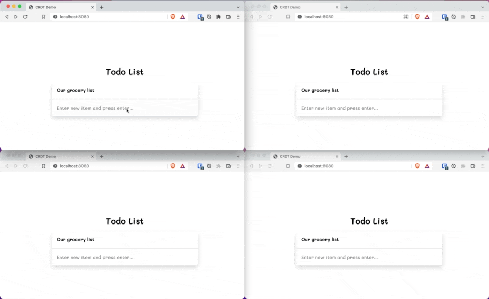

Sometime ago I was tinkering with some application that required state to be synchronized across different 'nodes'. 
In a previous job we already used something similar and I knew it was based on the idea of Conflict-Free Replicated
Data Types, however now I felt it was time to dive a little bit more into it and see if I can make something that would
work in a Kotlin Multiplatform environment.

## Why should I care about Conflict Free Replicated Data Types?

Imagine you have an application that has some state that the user is allowed to modify, like almost all applications.
If this application has multiple users working concurrently, we need to have _some_ way to synchronize the state between
the users. This isn't a new problem, so there are already a solutions to it. One that comes to mind is the good old 
transactional updates in a database. Make sure there is a central database and that every user can write to it in a way
that guarantees that consistency of the data-model is maintained. If one transaction is in progress while another one is
initiated by another user that changes something which is also in scope of the running transaction, then the second transaction
is rejected. Probably this will result in some sort of error to the user. Another solution might be to lock writes to the database for 1 user at a time.
Any other write will result in some error.

You can see already that we need some type of centralized database here and some form of centralized control.

So what happens if we have an application with a lot of users, like a game, with a lot of state updates? Do we need to lock
somewhere everytime? Wouldn't it be better if every user can be in control of its own state and we have a way to resolve
conflicts between those states?

## What are Conflict-Free Replicated Data Types

Well, to quote Wikipedia:

> A conflict-free replicated data type (CRDT) is a data structure which can be replicated across multiple computers in
> a network, where the replicas can be updated independently and concurrently without coordination between the replicas,
> and where it is always mathematically possible to resolve inconsistencies that might come up.

Okay, let's unpack that a bit shall we?

> A conflict-free replicated data type (CRDT) is a data structure which can be replicated across multiple computers in
> a network....

This makes sense and is pretty straight forward. We want to have some data structure to be replicated.

> ...where the replicas can be updated independently and concurrently...

So, every replica should be able to update to the latest version of the state by itself, and not by some external system.
Secondly, it should be possible for all replicas to do this at the same time, or at least without any temporal/causal relationship
between the replicas.

> ...without coordination between the replicas,...

This is a big one. There shouldn't be any supervisory system managing this. So no replica-servers, or command-and-control servers, etc.

> ...and where it is always mathematically possible to resolve inconsistencies that might come up.

This one is a bit formal I'd say. But what this means, in my opinion, is that we should have a clear set of functions that
describe how differences between multiple replicas are resolved.

There are two main branches in the CRDT-world on how to solve the conflicts:

- Operation based CRDTs
- State based CRDTs

### Operation based CRDTs

Operation based CRDTs, or commutative replicated data types (CmRDTs), update their state by specifying a very strict set
of operations which updated that state. However the big _requirement_ for these operations is that they are _commutative_,
which means that the order of applying those operations should not matter in the end result. 

So, to give a _very very very simple_ example:

```kotlin
fun incr(input: Int, amount: Int): Int = input + amount

val initialState = 0
val finalStateA = incr(incr(incr(initialState, -10), 5), -3)
val finalStateB = incr(incr(incr(initialState, 5), -3), 10)
```

As you can see it doesn't matter what order we use of the `incr(...)` functions, because the answer will always be: -8.

So in order to implement CmRDTs we need to the following:
- define all the applicable operations that can happen on the state
- make sure they are all commutative
- implement some sort of messaging protocol for the different CRDT's to communicate over, making sure no messages are dropped

The last point is pretty critical. If we miss one operation it means that the states are out of sync. So it is critical
that the communication protocol is robust.

Another drawback might be that it is very difficult to model the state using commutative operations. In some cases, 
like the example above, it might be trivial, but in some others it might require a PhD in computer science.

### State based CRDTs

State based CRDTs, or convergent replicated data types (CvRDTs), synchronize their state by having a dedicated function
that handles the converging, or merging, of two states to a single one. This merging function will contain all the logic
of the conflicts that might arise. When such a function exists it is only required that the different state holders all 
communicate their state to each other and merge the incoming state. Eventually this will lead to a consistent for all 
parties involved. Also here, the operation is commutative. It doesn't matter in which order you merge the states.

A very simple example might be:
```kotlin
val totalNumberOfClicksA = 10
val totalNumberOfClicksB = 35

fun merge(a: Int, b: Int) = max(a, b)

val mergedTotalNumberOfClicks = merge(totalNumberOfClicksA, totalNumberOfClicksB) // -> 35
```
This merge operation merges based on the highest value. But there are a different ways in handling the merges.

The downside here of course is that the full states need to be communicated to everyone.The upside of this method is
that it might be a bit easier to implement.

## Building convergent data types from the ground up

What we are going to do is create a few convergent data types from the ground up and see how we can compose them
to create more sophisticated types.

It all starts with defining an interface that all the CvRDT's need to adhere to:

```kotlin
interface Mergeable<T> where T : Mergeable<T> {
    fun merge(incoming: T): T
}
```

This interface only ensures us that a `Mergeable` value can merge with another one and returns a value of the same type
that is also `Mergeable`.

### A simple Last-Write-Wins type

In the above example we used a maximum value as the dominant value, but it is a bit of a weird example. You can imagine
that it makes more sense to have the _latest_ value to be dominant. User A writes a certain value, but User B writes 
another value at a later time.

Since we are working in Kotlin Multiplatform common code we need some date-time library that supports common code.
Luckily we can use [kotlinx-datetime](https://github.com/Kotlin/kotlinx-datetime). And we can write our implementation
like follows:

```kotlin
class MergeableValue<T>(
    val value: T,
    private val timestamp: Instant
) : Mergeable<MergeableValue<T>> {

    override fun merge(other: MergeableValue<T>): MergeableValue<T> = when {
        timestamp < other.timestamp -> other
        timestamp >= other.timestamp -> this
        else -> this
    }
}

// and some helper function
fun <T> mergeableValueOf(value: T) = MergeableValue(value, Clock.System.now())
```

As you can see we have a very simple solution here for merging. However, there is a very very sneaky bug in here, because
it isn't commutative. And we can demonstrate it via a test:

```kotlin
@Test
fun equalTimestamps() {
    val timestamp = Clock.System.now()
    val a = MergeableValue(1, timestamp)
    val b = MergeableValue(2, timestamp)

    val c1 = a.merge(b)
    val c2 = b.merge(a)
    assertEquals(c1, c2) // <- this one fails!
}
```

Somehow, `c1 != c2` even though the merge should be commutative. But looking closely to our implementation we see that
`timestamp >= other.timestamp -> this` returns `this` when the timestamps are equal. But when doing the different merges
the `this` is also different. So we need actually a different way to break the ties. For now I used the following:

```kotlin
override fun merge(other: MergeableValue<T>): MergeableValue<T> = when {
    timestamp < other.timestamp -> other
    timestamp > other.timestamp -> this

    // breaking ties based on hash
    hashCode() <  other.hashCode() -> other
    else -> this
}
```

And now it passes. Now we have a new tie when the hashcodes are equal _and_ the timestamps are equal. But at that moment
I just assume the values are equal as well. And... this is a hobby project, so I'll leave the exercise to the reader ;-).

Speaking of equality, what should happen if we do `mergeableValueOf(1) == mergeableValueOf(1)`? If the timestamps are different,
are they still equal? I decided that they should, so I wrote a test:

```kotlin
@Test
fun equalsTest() {
    val a = mergeableValueOf(1)
    sleep(1)
    val b = mergeableValueOf(1)
    assertEquals(a, b)

    val c = mergeableValueOf(2)
    assertNotEquals(a, c)
}
```

This one fails as well, and that is because we still needed to implement `equals` and `hashCode`:
```kotlin
class MergeableValue<T>(...) {
    ...
    override fun equals(other: Any?): Boolean {
        if (this === other) return true
        if (other == null || this::class != other::class) return false

        other as MergeableValue<*>
        if (value != other.value) return false
        return true
    }

    override fun hashCode(): Int {
        return value.hashCode()
    }
}
```
And now it passes!

As a final test we add some randomized fuzzing test, where we shuffle a list of mergeables, and merge them all together.
It shouldn't matter in what order they are merged:
```kotlin
@Test
fun fuzz() {
    val values = (0 until 1000).map { mergeableValueOf(it) }
    val mergedA = values.shuffled().reduce { a, b -> a.merge(b) }
    val mergedB = values.shuffled().reduce { a, b -> a.merge(b) }
    assertEquals(mergedA, mergedB)
}
```
And this one also passes!

So we have basic values nailed down, time to move to the next data type, a map.

### A mergeable Map

One of the most used data types is a map and it makes sense to implement a mergeable version of that as well. To keep things simple I want to keep them immutable. This means that when we want to mutate we need to create a new one with the mutations. However, this would be very memory-inefficient if we would copy everything over everytime, so luckily there is a concept called [persistent data structures](https://en.wikipedia.org/wiki/Persistent_data_structure) that solves this problem. So we can have immutability while having some more optimal memory usage. And, there is already a [Kotlin persistent / immutable data collection library](https://github.com/Kotlin/kotlinx.collections.immutable).

So based on this we can define our map signature like follows:
```kotlin
class MergeableMap<K, V>(
    // t.b.d.
) : Map<K, V>, Mergeable<MergeableMap<K, V>> {
    // add a new entry
    fun put(key: K, value: V): MergeableMap<K, V>

    // remove an entry
    fun remove(key: K): MergeableMap<K, V>
}

fun <K, V> mergeableMapOf(vararg pairs: Pair<K, V>): MergeableMap<K, V>
```

Compared to a simple value a map is a bit more complex, because there are a few merge situations we have to take into account. We go through them one by one.

#### Conflicting keys

Imagine the following situation:

```kotlin
val mapA = mergeableMapOf("a" to 1, "b" to 2)
val mapB = mergeableMapOf("a" to 3, "c" to 4)
val merged = mapA.merge(mapB)  // should 'a' be 1 or should 'a' be 3?
```

Looking at this example our natural instict would be to say `a == 3` in `merged`. So basically that is the same Last-Write-Wins scenario we had in the `MergeableValue` case, so we might be able to reuse that.

#### Removals

A removal should be like this;
```kotlin
val mapA = mergeableMapOf("a" to 1, "b" to 2)
val mapB = mergeableMapOf("a" to 3, "c" to 4).remove("a")
val merged = mapA.merge(mapB) // should 'a' exist or not?
```

In this situation it makes sense that `a` is removed in the merge. However, `mapB` doesn't contain `a` anymore and as such how do we know that it should be removed in the merge? We can do that by registering removals in a so-called _tombstone_ set. This means we have a set of keys describing which items have been removed from the mapping. And when merging we can see if there are keys in the tombstone set in `mapB` that are still in the actual map of `mapA` and can be removed. 

No, imagine the following situation:
```kotlin
val mapA = mergeableMapOf("a" to 1, "b" to 2).remove("a")
val mapB = mergeableMapOf("a" to 3, "c" to 4) // this one is later in time
val merged = mapA.merge(mapB) // should 'a' exist or not?
```

This depends on the implementation. For me, it makes sense to have a map behave like a map should and as such we add elements that have previously been removed. However, there are implementations out there that make removals permanent. To implement the behavior I need we also need to keep track of the timestamp of a removal. If a value exists that has a timestamp that is later than an existing tombstone, the value is retained.

#### Implementation

With the above information we can start the basic implementation using persistent data types as backing data structures.

```kotlin
data class MergeableMap<K, V>(
    val map: PersistentMap<K, MergeableValue<V>>,
    val tombstones: PersistentMap<K, Instant>
): Map<K, V>, Mergeable<MergeableMap<K, V>> {

    fun put(key: K, value: V): MergeableMap<K, V> = copy(
        map = map.put(key, mergeableValueOf(value)),
        tombstones = tombstones.remove(key)
    )

    fun remove(key: K): MergeableMap<K, V> = copy(
        map = map.remove(key),
        tombstones = tombstones.put(key, Clock.System.now())
    )

    // ... Map implementation

    // ... Mergeable implementation
}
```

The `put` and `remove` operations are a pretty straightforward implementation of the basic _immutable_ operations on a map.

The `Mergeable` implementation is a bit more complicated and this is where the `tombstones` and `MergeableValue` of `map` come into play:
```kotlin
data class MergeableMap<K, V>(
    val map: PersistentMap<K, MergeableValue<V>>,
    val tombstones: PersistentMap<K, Instant>
): Map<K, V>, Mergeable<MergeableMap<K, V>> {
    // ...

    override fun merge(other: MergeableMap<K, V>): MergeableMap<K, V> {
        // first we need all the tombstones and all the keys merged 
        val allTombstones = mergeTombstones(other.tombstones) 
        val allKeys = (map.keys + other.map.keys)

        val elements = mutableMapOf<K, MergeableValue<V>>()

        // here we build up the elements map 1-by-1
        allKeys.forEach { key ->
            val (left, right) = map[key] to other.map[key]

            // we determine which value should be placed in the map
            val winner = when {
                left != null && right == null -> left
                left == null && right != null -> right
                else -> left!!.merge(right!!) // here we leverage the merge of the MergeableValue
            }

            when {
                // when there is no matching tombstone we add the element
                !allTombstones.contains(key) -> {
                    elements[key] = winner
                }

                // however if there _is_ a matching tombstone we add it only if the element has a later or equal timestamp
                winner.timestamp >= allTombstones[key]!! -> {
                    allTombstones.remove(key) // in that case we need to remove the tombstone
                    elements[key] = winner
                }

                // else we don't add the element
            }
        }
        return MergeableMap(
            map = elements.toPersistentMap(),
            tombstones = allTombstones.toPersistentMap()
        )
    }

    // this helper function make sure the tombstones are merged according to the last timestamps
    private fun mergeTombstones(other: PersistentMap<K, Instant>) = (tombstones.keys + other.keys).map { key ->
        key to maxOf(tombstones[key] ?: Instant.DISTANT_PAST, other[key] ?: Instant.DISTANT_PAST)
    }.toMap().toMutableMap()
}

// and some helper functions
fun <K, V> mergeableMapOf(map: Map<K, V>): MergeableMap<K, V> = MergeableMap(
    map.mapValues { (_, v) -> mergeableValueOf(v) }.toPersistentMap(),
    persistentMapOf()
)

fun <K, V> mergeableMapOf(pairs: Iterable<Pair<K, V>>): MergeableMap<K, V> = mergeableMapOf(pairs.toMap())
fun <K, V> mergeableMapOf(vararg pairs: Pair<K, V>): MergeableMap<K, V> = mergeableMapOf(pairs.asIterable())
fun <K, V> mergeableMapOf(): MergeableMap<K, V> = mergeableMapOf(mapOf())
```

I've also written some tests, but the most interesting one is a fuzzing test:

```kotlin
@Test
fun fuzzing() {
    val keysAndValues = (0 until 1000).toList()

    val added = mutableSetOf<Int>()
    val removed = mutableSetOf<Int>()

    fun generate() = keysAndValues.fold(mergeableMapOf<Int, String>()) { acc, i ->
        when  {
            Random.nextFloat() < .7 -> {
                added.add(i)
                acc.put(i, i.toString())
            }
            else -> acc
        }
    }

    fun remove(map: MergeableMap<Int, String>) = keysAndValues.fold(map) { acc, i ->
        when {
            Random.nextFloat() < .1 -> {
                removed.add(i)
                acc.remove(i)
            }
            else -> acc
        }
    }

    val merged = merge(listOf(generate(), generate(), generate()).map { remove(it) })
    val totals = added - removed
    assertEquals(totals.size, merged.keys.size)
}
```

As can be seen we are generating a lot of maps by filling them with an Int to String mapping. They are added with a chance of 70% in each mapping.
In the next step items are removed again with a chance of 10%. We can calculate what we expect the total merged mapping to be.

## Serialization

It is important for the CRDT's to be send over the network to other clients, and as such they needed to be serialized. Luckily we can use the excellent [kotlinx-serialization](https://github.com/Kotlin/kotlinx.serialization) library for this! 

For the `MergeableValue` data type it is as easy as adding the `@Serializable` annotation:

```kotlin
@kotlinx.serialization.Serializable // <- magic
class MergeableValue<T>(
    val value: T,
    val timestamp: Instant
) : Mergeable<MergeableValue<T>> {
    // ...
}

// example
val value = mergeableValueOf("Foo")
val serialized = Json.encodeToString(value)

// returns: {"value":"Foo","timestamp":"2022-06-21T15:14:35.266821Z"}
```

This works because the `kotlinx-datetime` library contains datatypes which are serializable!

The `MergeableMap` data type is a bit more difficult though. This is because `kotlinx.collections.immutable` doesn't implement serialization at the moment. Luckily we can create our own `Serializer`. Since we can create `PersistentMap` from a normal `Map` we can just reuse the `MapSerializer`:

```kotlin
// the keySerializer and valueSerializer will be passed to this serializer via the serializer-compiler plugin
class MergeableMapSerializer<K, V>(keySerializer: KSerializer<K>, valueSerializer: KSerializer<V>) : KSerializer<MergeableMap<K, V>> {

    // now we define the serializers for the map and the tombstone attribtutes
    private val mapSerializer = MapSerializer(keySerializer, MergeableValue.serializer(valueSerializer))
    private val tombstonesSerializer = MapSerializer(keySerializer, Instant.serializer())

    override val descriptor: SerialDescriptor = buildClassSerialDescriptor("mergeableMap") {
        element("map", descriptor = mapSerializer.descriptor)
        element("tombstones", descriptor = tombstonesSerializer.descriptor)
    }

    // we can use the serializers above to do the proper serialization
    override fun serialize(encoder: Encoder, value: MergeableMap<K, V>) {
        encoder.encodeStructure(descriptor) {
            encodeSerializableElement(descriptor, 0, mapSerializer, value.map)
            encodeSerializableElement(descriptor, 1, tombstonesSerializer, value.tombstones)
        }
    }

    // when we deserialize we create simple Maps and create PersistentMaps from them
    override fun deserialize(decoder: Decoder): MergeableMap<K, V> = decoder.decodeStructure(descriptor) {
        var map: Map<K, MergeableValue<V>> = mapOf()
        var tombstones: Map<K, Instant> = mapOf()

        while (true) {
            when (val index = decodeElementIndex(descriptor)) {
                0 -> map = decodeSerializableElement(descriptor, index, mapSerializer)
                1 -> tombstones = decodeSerializableElement(descriptor, index, tombstonesSerializer)
                CompositeDecoder.DECODE_DONE -> break
            }
        }
        MergeableMap(map.toPersistentMap(), tombstones.toPersistentMap())
    }
}
```

And we can use it like this:
```kotlin
@kotlinx.serialization.Serializable(with = MergeableMapSerializer::class)
data class MergeableMap<K, V>(
    val map: PersistentMap<K, MergeableValue<V>>,
    val tombstones: PersistentMap<K, Instant>
): Map<K, V>, Mergeable<MergeableMap<K, V>> {
    // ....
}
```

And when we serialize `mergeableMapOf("a" to 1, "b" to 2, "c" to 3).remove("c")` we get:
```json
{
    "map": {
        "a": {
            "value": 1,
            "timestamp": "2022-06-21T15:16:28.733454Z"
        },
        "b": {
            "value": 2,
            "timestamp": "2022-06-21T15:16:28.733463Z"
        }
    },
    "tombstones": {
        "c": "2022-06-21T15:16:28.744279Z"
    }
}
```

## Sharing mergeables with Coroutines

Having a mergeable works great, and merging works great, and serialization works great. But is important to tie them all together. Ideally we want to have a `Mergeable<T>` to be able to `merge` and publish its updates somewhere else so other can subscribe again to it and merge with those.

Coroutines offers a facility called [`StateFlow<T>`](https://kotlinlang.org/api/kotlinx.coroutines/kotlinx-coroutines-core/kotlinx.coroutines.flow/-state-flow/) which is:

> A SharedFlow that represents a read-only state with a single updatable data value that emits updates to the value to its collectors.

This sounds like something we can use, so we are going to extend that interface:

```kotlin
interface MergeableStateFlow<T : Mergeable<T>> : Mergeable<T>, StateFlow<T> {
    fun update(block: (state: T) -> T)
}
```

What we have now is an interface which is can also `merge` incoming `T`'s, but is also a *read-only* `StateFlow<T>`. Besides that we have an extra `update` method (borrowed from the `MutableStateFlow` interface). The reasoning is as follows:

- `merge` is used for incoming `Mergeable<T>`'s. The merged value is the new value of the `StateFlow`. When this value differs from the original one, `StateFlow` will emit the new one to its collectors.  
- `update` is used to replace the value of the current `StateFlow` without merging. This new value is also emitted.

Another large benefit of `StateFlow` is that it plays very nice with Compose.

### Implementation

Luckily the implementation is dead-simple, mainly because of the delegation pattern:

```kotlin
private class MergeableStateFlowImpl<T : Mergeable<T>>(
    private val _states: MutableStateFlow<T>
) : MergeableStateFlow<T>, StateFlow<T> by _states {

    override fun merge(other: T): T {
        _states.update { current -> current.merge(other) }
        return value
    }

    override fun update(block: (state: T) -> T) {
        _states.update(block)
    }
}
```

We delegate `StateFlow<T>` to `_states` so none of those methods need to be implemented. The implementation of the remaining methods is trivial.
Now we can also write some convencience functions:

```kotlin
fun <T : Mergeable<T>> T.asStateFlow(): MergeableStateFlow<T> = MergeableStateFlowImpl(MutableStateFlow(this))

fun <T : Mergeable<T>> MergeableStateFlow<T>.mergeWith(other: MergeableStateFlow<T>, scope: CoroutineScope) {
    other.onEach { update -> this.merge(update) }.launchIn(scope)
}
```

### Testing

Testing coroutines was always a bit difficult, but luckily we now have `runTest` in the test package of Coroutines, which allows us to control the coroutine scheduler and provide a very testable `CoroutineScope`.

I have written more tests, but the most important one is one where we send values from and to different mergeables, simulating they are on different clients:

```kotlin
@Test
fun multiple() = runTest { // this is a special TestScope which we use to inject in our other functions and control the structured concurrency
    val flowA = MergeableValue(0, Instant.fromEpochMilliseconds(0)).asStateFlow() // create one at t=0
    val flowB = MergeableValue(1, Instant.fromEpochMilliseconds(1)).asStateFlow() // create another one at t=1
    runCurrent() // this is a test function to run all the jobs currently in the job queue of the scheduler

    flowA.mergeWith(flowB, scope = this) // use the convenience function from above to subscribe and merge to its updates
    flowB.mergeWith(flowA, scope = this) // and vice-versa
    runCurrent() 

    assertEquals(flowA.value, flowB.value) // they should now be equal even though they started different
    assertEquals(1, flowA.value.value)

    flowA.update { MergeableValue(2, Instant.fromEpochMilliseconds(2)) } // if we update one, the other should sync
    runCurrent()

    assertEquals(flowA.value, flowB.value)
    assertEquals(2, flowA.value.value)
    currentCoroutineContext().cancelChildren() // since the flows are HOT, they need to be cancelled
}
```

### Synchronizing with an external source

Although the `mergeWith` function works great, it is more important to synchronize and distribute with an external source. As such it is important to distribute the values over some of `Bus` and be able to send and receive from it and merge. To generalize it, I have some convenience interfaces in my common code in multiple projects to abstract away a `MessageBus`. I am aware I could use `Channel`, but in my opinion they are heavily Coroutine focussed, and has some defined behavior, and my `MessageBus` is used to abstract away platform dependent messaging implementations. For instance, the `BroadcastChannel` on the Web, which we want to wrap with these interfaces.

The interfaces are defined like this:
```kotlin
interface MessageBus<T> : ReceiveBus<T>, SendBus<T>

interface SendBus<T> {
    suspend fun send(item: T)
}

interface ReceiveBus<T> {
    val messages: SharedFlow<T>
}
```

Implementing a `BraodcastChannel` from the Web with this interface is pretty simple:

```kotlin
fun BroadcastChannel.asMessageBus(
    scope: CoroutineScope
): MessageBus<String> = object : MessageBus<String> {

    private val _messages = MutableSharedFlow<String>()
    override val messages: SharedFlow<String> = _messages

    init {
        this@asMessageBus.onmessage = { event ->
            (event.data as? String)?.also { data ->
                scope.launch {
                    _messages.emit(data)
                }
            }
        }
    }

    override suspend fun send(item: String) {
        this@asMessageBus.postMessage(item)
    }
}
```

What we now need to do is somehow sync the `MergeableStateFlow<T>` with this `MessageBus`. This means the following:
- subscribe to changes from the message bus and merge them
- if the merged value is different from the change it means that this change also needs to be published
- on a change of the stateflow itself it should publish the changes
- do an initial publish to notify your own state

This can be implemented like this:
```kotlin
fun <T: Mergeable<T>> MergeableStateFlow<T>.sync(
    messageBus: MessageBus<T>,
    scope: CoroutineScope
) {
    this.onEach { update ->
        messageBus.send(update) // on an update of the StateFlow, we publish
    }.launchIn(scope)

    messageBus.messages.onEach { update ->
        // if we get a new value we merge
        // please note that after this.merge it is already merged internally and we receive the merged value
        val merged = this.merge(update)
        if (merged != update) {
            // the merged value is different than the update we received, so the sender should also be updated
            messageBus.send(update)
        }
    }.launchIn(scope)

    // initial publish
    scope.launch {
        messageBus.send(value)
    }
}
```

We also need serialization and deserialization, but that is something that is a bit out of scope of this blog post, and can easily be seen in my final code samples. The gist is that I implemented some transformers for `MessageBus` interfaces to transform between types and allow us to pass in `T` but have it automatically serialized.

## Creating a very simple Compose for Web app

We now have all the building blocks to create a very simple web application. It will work as follows:
- We have a mergeable state which is a simple counter
- We share the state via a browser `BroadcastChannel`
- We have two buttons to update the state: increase or decrease

We needed one convenience function for this still, and that is `mergeableDistantPastValueOf`. When we first announce our state to the `MessageBus` it can be the case it is newer than all the other ones, but it is initialied at 0 and not synced yet. To overcome this we force the timestamp of the `MergeableValue` to the distant past:

```kotlin
fun <T> mergeableDistantPastValueOf(value: T) = MergeableValue(value, Instant.DISTANT_PAST)
```

Our whole application looks like this:
```kotlin
fun main() {
    // create a scope to launch in
    val scope = CoroutineScope(Dispatchers.Default)

    // create a BroadcastChannel and turn it into a Messagebus<String>
    val channel = BroadcastChannel("updates").asMessageBus(scope)

    // create the state and turn it into a MergeableStateFlow
    val states = mergeableDistantPastValueOf(0).asStateFlow()

    // sync the states. channel.deserialize creates a MessageBus<T> from MessageBus<String> 
    states.sync(channel.deserialize(scope), scope)

    renderComposable("root") {
        // using the magic of collectAsState() we turn this into a State<T>
        val counter by states.collectAsState()

        Header("Current value: ${counter.value}")
        Button("Increase") { states.update { mergeableValueOf(it.value + 1) } }
        Button("Decrease") { states.update { mergeableValueOf(it.value - 1) } }
    }
}

/* Header and Button omitted */
```

And this gives us the following result:



Not very impressive, but there is a lot happening under the hood!

## Next steps

The final result was very very small, but I think this has a lot of potential to experiment further with. I am planning to create a small web (or desktop, or both) app that uses CRDT's to sync their state to explore this idea a bit more and write about it. This article was a lot of plumbing a not a lot of actual results. Nevertheless I had a lot of fun and I learned a _lot_. 